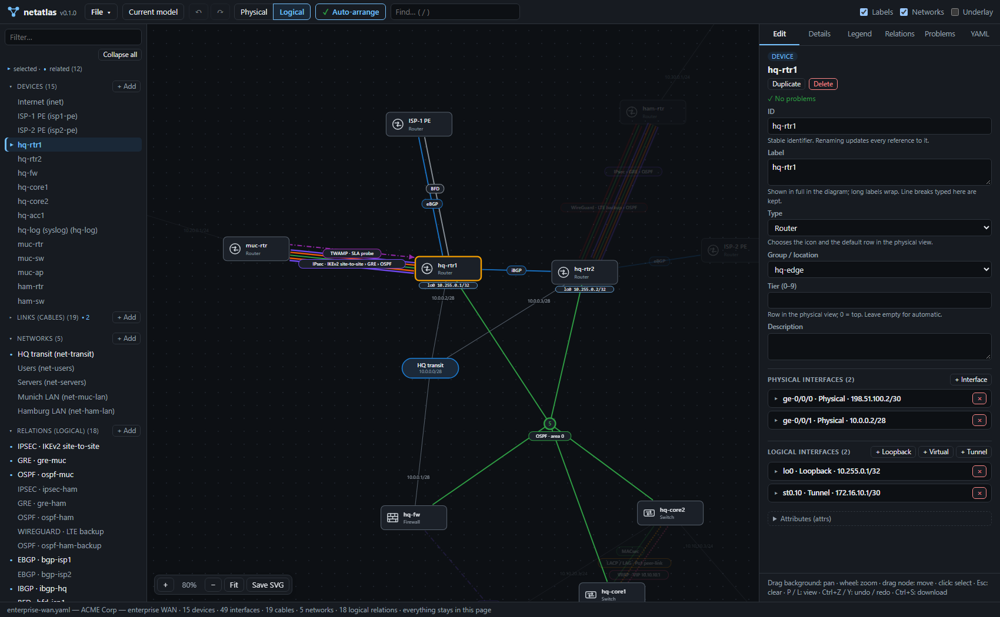
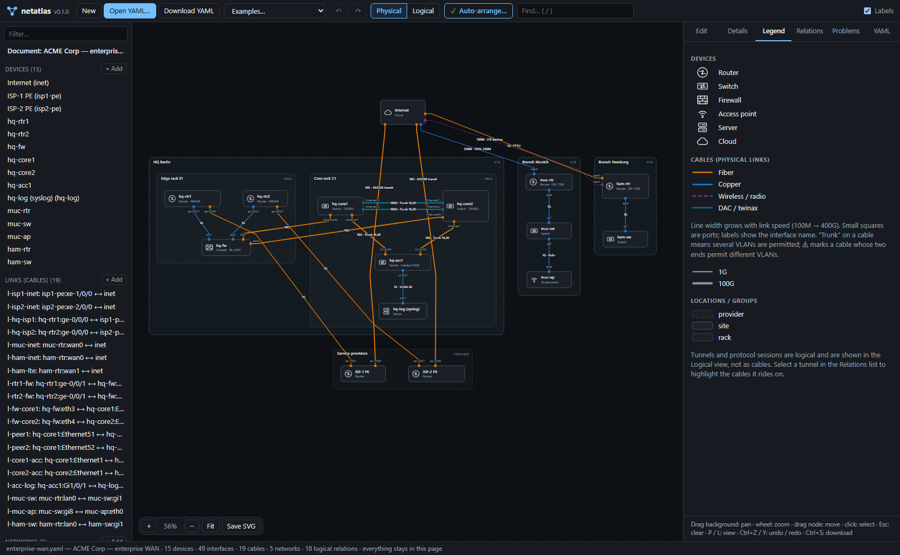
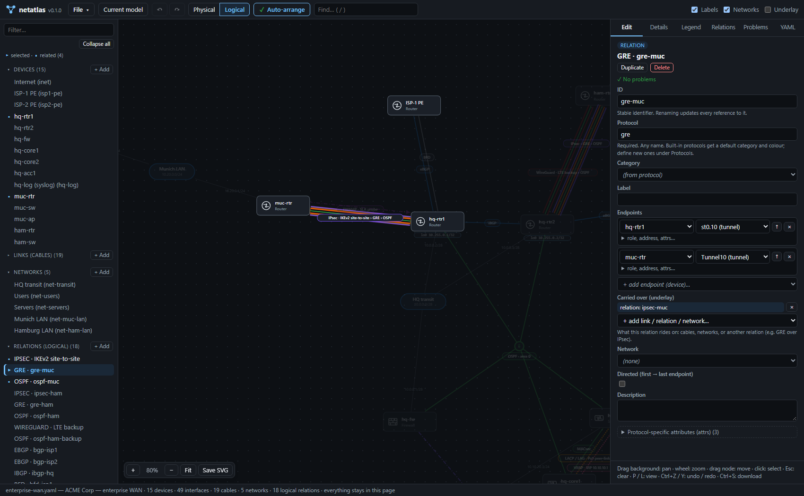
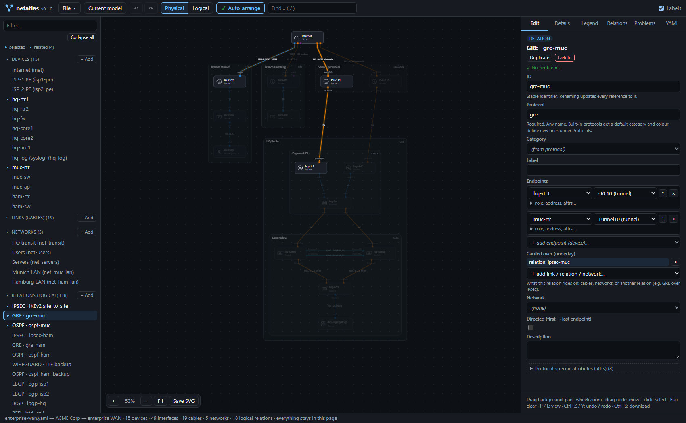
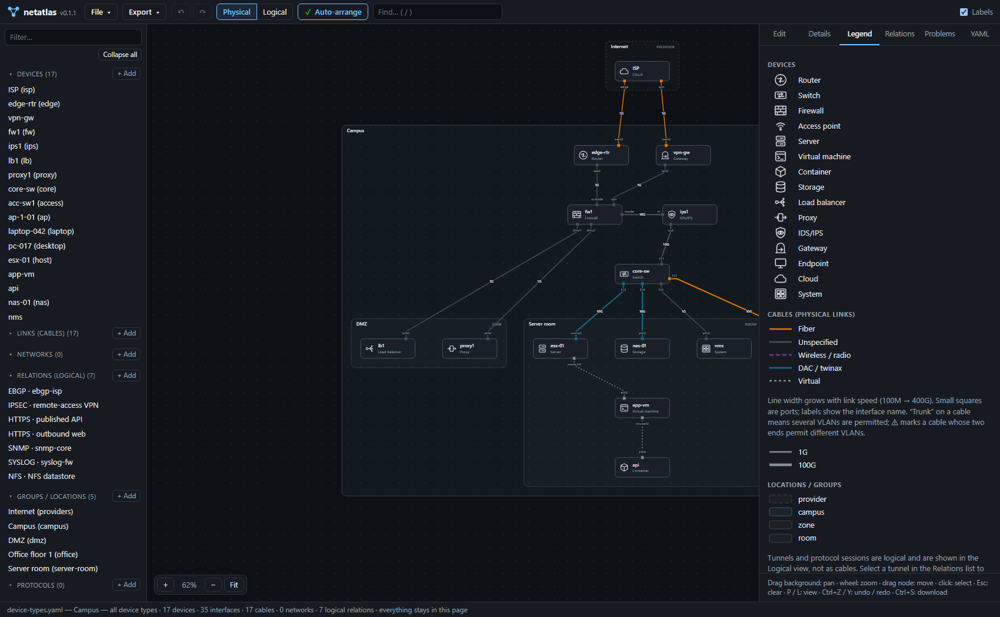
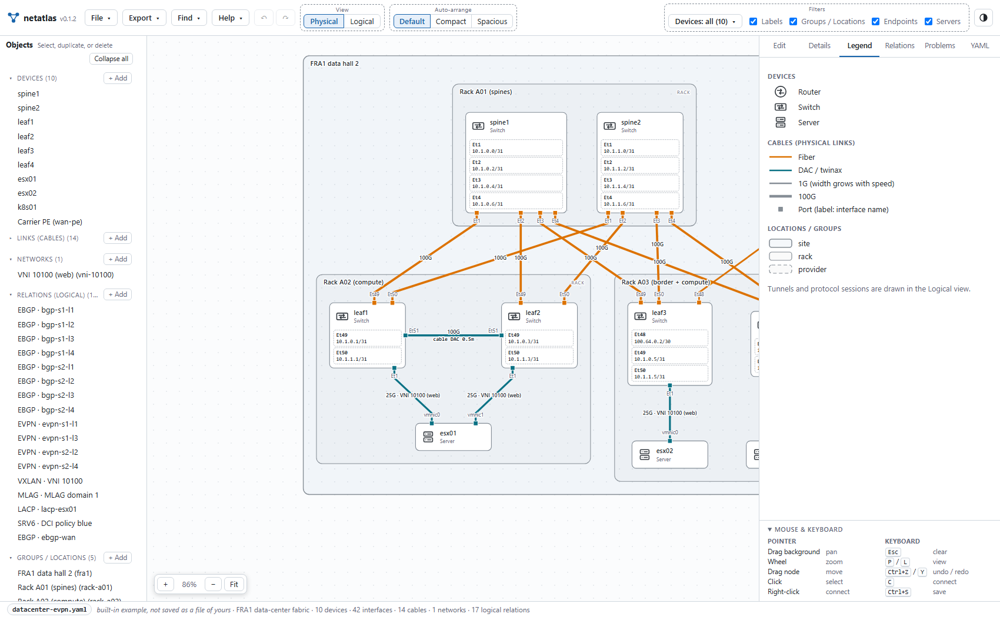
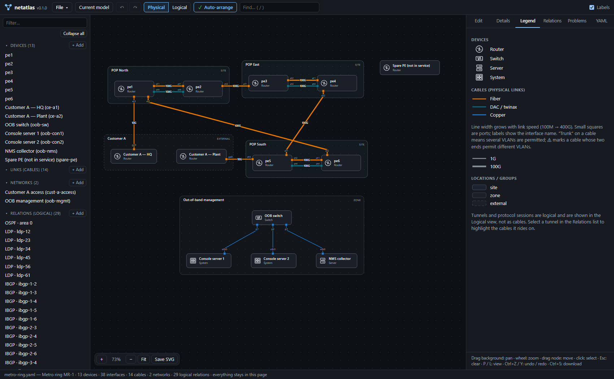
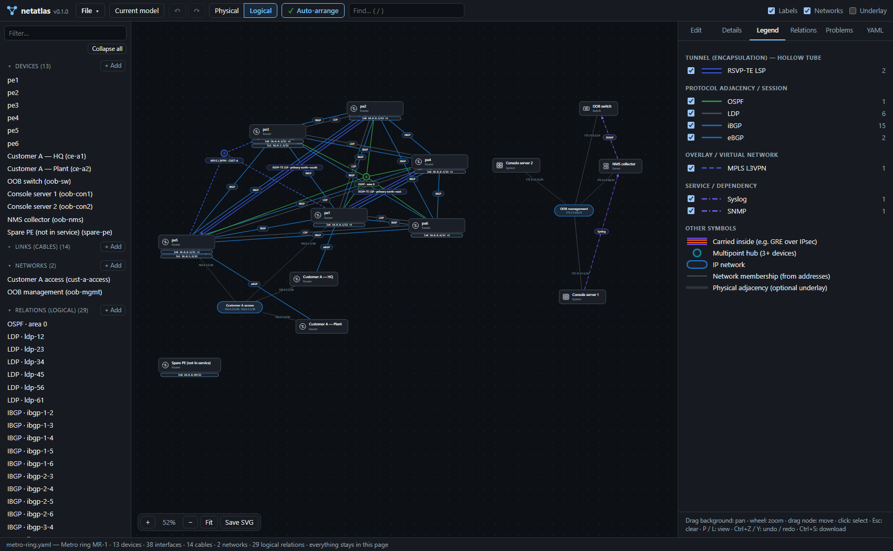

# NetAtlas

**NetAtlas — an explorable map of a network architecture.**

NetAtlas lets you create, edit and explore physical and logical network
diagrams from a single YAML file, entirely offline. The whole tool is one
self-contained HTML file, `dist/netatlas.html`, that runs in any modern
browser, including on an air-gapped machine. Start a new model or open a YAML
file, then:

* **Physical view:** devices, their ports (with interface names), cabling
  (medium, speed, and the VLANs each end permits, e.g. a trunk), and
  locations such as sites, floors, rooms and racks, drawn as nested boxes.
* **Logical view:** IP networks with their members, device loopbacks,
  routing adjacencies, overlays, redundancy groups, services, and tunnels such
  as GRE and IPsec. Tunnels are drawn as hollow tubes; a relation carried over
  a tunnel (e.g. GRE over IPsec, OSPF over GRE) is drawn *inside* its tube.
* **Editor:** a model outline plus a property inspector. It can create,
  change and delete every part of the model: devices, their physical and
  logical interfaces (loopbacks, virtual interfaces, tunnel interfaces),
  links, networks, relations and tunnels, groups, protocol definitions,
  free-form attributes, and even keys the format doesn't define. Validation
  runs as you type, and the diagram updates immediately. **Download model…**
  saves the model as a portable YAML file.

There's nothing to install, no server, and no network access. YAML remains
the model: the page reads it, edits it and writes it back.

> **Breaking change on `dev` (unreleased): the YAML format was restructured.** Each fact
> is now configured in one place and derived everywhere else: network
> members and interface VLANs are computed from addresses, speed and medium
> live only on the link, and each link end lists its own VLANs. The version
> line stays `netatlas: 1`, but files written for release 0.1.x that use the
> removed keys are **not converted**; they open as a draft with one error
> per key to change. See
> [Changes from the earlier format](docs/FORMAT.md#changes-from-the-earlier-format).

**Version 0.1.0**, the first release. It's a usable initial version; see
the [changelog](CHANGELOG.md) for what it covers, and
[Limitations](#limitations-honest-list) for what it doesn't.

| Editor: outline, inspector with the device type, loopbacks; logical view | Physical view of the same network |
|---|---|
|  |  |

| Selecting the GRE tunnel: IPsec → GRE → OSPF in the logical view… | …and the cables it rides on in the physical view |
|---|---|
|  |  |

| All 15 device types, each with its own icon; the legend lists them by name | Data-center fabric: spines raised with `tier`, leaves, servers |
|---|---|
|  |  |

| **Auto-arrange**, physical: POP sites, customer, separate OOB island | **Auto-arrange**, logical: iBGP mesh between loopbacks, tunnels, OOB component |
|---|---|
|  |  |

The **Auto-arrange** button sits in the top toolbar and arranges the view on
screen. Its icon shows that view's layout status (✓ matches the
auto-arranged layout, ✎ manually adjusted).

## Open it, create or load a model

1. Get `netatlas.html`: attach it from the
   [GitHub release](https://github.com/hafnerst/netatlas/releases), or take
   `dist/netatlas.html` from this repository (or build it, see *Build*).
   It's the only file you need. Open it in Chrome, Edge, Firefox or Safari. Double-click
   it, drag it into a browser window, or enter its `file:///…/netatlas.html`
   path in the address bar. (Don't open `src/index.html`: that's only the
   build template.)
2. Open the **File** menu at the top left and either:
   * choose **New model** to start from an empty model, then add objects
     with **+ Add** in the model outline on the left;
   * choose **Open model…** and pick a `.yaml` / `.yml` file, or drag a
     file anywhere onto the page;
   * choose one of the built-in files under **Examples**.
3. Switch between **Physical** and **Logical** (or press `P` / `L`).
4. Click anything in the diagram or in the model outline on the left. The
   **Edit** tab on the right opens it in the inspector. **Current model** in
   the toolbar opens the settings of the model as a whole (title,
   description).
5. Choose **File → Download model…** (or press Ctrl+S) to save the model as
   a YAML file.

### The toolbar

| Control | What it does |
|---|---|
| **netatlas** logo and version | which build this is |
| **File ▾** | one menu for everything about files: **New model**, **Open model…**, **Download model…** (Ctrl+S) and, under **Examples**, the built-in files. An entry ends in “…” when it asks for something before it acts (a file to pick, a file name to confirm). It closes after a choice, with Esc, or when you click elsewhere; the arrow keys move through it. |
| **Current model** | opens the edit view of the entire model: its title, description and format version, and any problem that doesn't belong to a single object (shown as a badge on the button). |
| ↶ ↷ | undo and redo |
| **Physical** / **Logical** | the two views |
| **Auto-arrange** | arranges the view on screen; its icon shows the layout status |
| **Find…** | search by id, label, address, prefix, protocol or cable id (`/`) |

### The model outline

The panel on the left lists the model by section: devices, links, networks,
relations, groups and protocols. Each heading shows how many entries it has
and folds its section when clicked. **Links** and **Protocols** start folded;
**Collapse all** / **Expand all** at the top does all of them at once.
Folding only changes what is listed: a folded heading still shows the number
of problems inside the section and, when something is selected, how many of
its entries are related; the selected entry itself stays visible, the filter
box searches folded sections too, and **+ Add** opens the section it adds to.

Files are read with the browser's File API, edited in memory and saved as a
browser download. They're never sent anywhere. The page's
Content-Security-Policy (`default-src 'none'`, `connect-src 'none'`) makes
network access impossible even in principle.

## Editing

| Task | How |
|---|---|
| Add an object | **+ Add** next to a section of the Model outline (devices, links, networks, relations, groups, protocols). A new object gets only a unique ID; **nothing else is chosen for you**. A device has no type, a group no kind, a network no prefix or VLAN, a protocol no category, a relation no protocol (fields show prompts such as *Select device type*). Until you fill them in, the missing required values (a relation's protocol and endpoints, a link's ends) are reported as errors. |
| Duplicate | **Duplicate** on an object copies all its values and attributes under a new ID. |
| Edit fields | Type in the inspector. A change is applied when you press Enter, leave the field, or click anything else, including the diagram. |
| Rename an ID | Edit the **ID** field. Every reference (links, endpoints, `over`, group parents, protocol names) is updated, and a notice says how many. |
| Interfaces | A device lists its interfaces in two categories. **Physical interfaces:** **+ Interface** adds a port; its **Type** is the read-only text *Physical*. **Logical interfaces:** **+ Loopback**, **+ Virtual** and **+ Tunnel** add one of that type; the **Type** field offers exactly *Loopback*, *Virtual* and *Tunnel*. Each entry is a collapsible card with an address list, attributes, and what uses it. A card shows only the association that fits its type: **Member ports** (a virtual interface that is a bond: pick physical interfaces of the device), **VLAN ID** and the read-only **Ports carrying VLAN** (a VLAN interface), **Tunnel source** and **Tunnel destination** (a tunnel). There is no parent field. **Network / VLAN** and **Ports carrying VLAN** are *derived*: they can't be edited and change as soon as an address, a network or a link end changes. Cards are listed alphabetically within each category; the order in the YAML file is left as it is. |
| Networks | A network is its prefixes and, optionally, the VLAN it lives in. **Members** is *derived*: every device with an interface or loopback address inside a prefix, listed once with the matching interfaces and addresses. To add a member, give it an address in the network. |
| Link VLANs (trunks) | On a link, **End A VLANs** and **End B VLANs** each take any number of VLAN IDs: pick a VLAN that a network defines, or type IDs (`10, 20, 30-32`). Several IDs read **Trunk**, one reads **VLAN n**, none reads **No VLAN**. Each end is stored separately; if they differ, a warning shows the difference and nothing is changed for you. Speed and medium are set here too, and only here. |
| Endpoints | Device and interface pickers, alphabetical. A relation endpoint can use any interface (logical ones are labelled *loopback*, *virtual* or *tunnel*); a link end offers physical interfaces only. Role, address and endpoint attributes are under "role, address, attrs…". |
| Tunnel underlay (`over`) | Pick links, relations or networks from the list, e.g. GRE over IPsec over two cables. |
| Protocol-specific settings | **attrs** on a relation (and on each endpoint): an editable tree of values, groups and lists of any depth |
| Keys the format doesn't know | Shown under **Other properties**. They're kept and exported, and reported as errors. Use **→ attrs** to move one into `attrs`. |
| Delete | **Delete** on the object. The dialog says how many references will break; broken references are then listed as errors, never removed silently. |
| Undo / redo | Toolbar arrows, or Ctrl+Z / Ctrl+Y (up to 100 steps) |
| Raw YAML | The **YAML** tab shows the model exactly as it will be exported. Edit and **Apply** (text that doesn't parse is rejected with its line number; unapplied text survives tab switches). |
| Problems | The **Problems** tab lists all errors and warnings; click one to jump to the object. Objects with errors get a red badge in the outline and a dashed red outline in the diagram. The inspector shows each message under the affected field. |

**Saving is a download of a new file.** A web page can't overwrite a file on
your disk. For an imported file the download dialog says so, and suggests the
name `<original>-edited.yaml`; your original stays untouched. If the model has
validation errors, the dialog lists them and the button becomes **Download
anyway**. Invalid models are only exported after that explicit confirmation.

**Unsaved changes.** The status bar shows "● unsaved changes" and the title
gets a ●. **New model**, **Open model…**, the examples and dropping a file all ask first
(*Cancel* / *Download first…* / *Discard changes*). Closing or reloading the
tab triggers the browser's own "leave page?" prompt.

**Drafts are allowed.** A file with validation errors (broken references, a
loopback without an address, …) opens and is drawn as far as it's valid, so
you can repair it in the editor. Only input that isn't valid YAML in the
supported subset is refused before editing, with the line number.

### Physical and logical interfaces

A device stores each interface once, in one of two lists:

* `interfaces`: its **physical interfaces** (ports). They have no type to
  choose, and only they can be cabled.
* `logical_interfaces`: its **logical interfaces**, each with a `type`:
  `loopback`, `virtual` (a VLAN interface, a bond, a subinterface, a VTEP …)
  or `tunnel`.

Logical interfaces are not nested under ports and have no generic "parent"
field. Each kind of association is modelled by what it means:

| Interface | What you enter | What is derived |
|---|---|---|
| Loopback | its addresses (with prefix length) | — (it has no physical parent) |
| Bond / aggregate (`virtual`) | **Member ports**: `members: [eth0, eth1]`, physical interfaces of the same device | highlighting of the ports and their cables |
| VLAN interface (`virtual`) | its VLAN: `vlan: 10`, or nothing if its address lies in a network that defines the VLAN | **Ports carrying VLAN**: the device's ports whose link end permits that VLAN |
| Any other `virtual` interface | nothing | nothing; no association is assumed |
| Tunnel | **Tunnel source** (any interface of the device, physical or logical, or an address) and **destination** (an address, a device or `device:interface`) | the source interface when an address is written; highlighting of source and destination |

Relations can use any interface as an endpoint. Loopbacks are drawn as chips
under the device in the logical view; logical interfaces are never drawn as
ports. A device has no vendor, model, role, management-address or router-ID
field; keep such facts as free-form attributes if you need them. The full
rules are in [docs/FORMAT.md](docs/FORMAT.md#interfaces).

### What round-trips

Everything the file contains survives **load → edit → export → reload**,
including attributes no diagram shows, unknown keys, nested structures,
comments, key order and quoting style. Indentation is normalized to 2 spaces
and `>` blocks become `|` blocks with the same value. The example files are
written back byte-for-byte. The details are in
[docs/YAML-SUBSET.md](docs/YAML-SUBSET.md#writing-yaml-export-from-the-editor).

## Working with the diagram

| Action | How |
|---|---|
| Pan / zoom | drag the background; mouse wheel; `+` `−` `Fit` buttons; arrow keys, `+`, `-`, `0` |
| Select | click any device, port, loopback chip, cable, tunnel, hub or network. The **Edit** tab opens it; **Details** gives a read-only summary. |
| Highlight | selecting something dims everything unrelated. For a tunnel this includes its carriers, what it carries, its endpoints and, in the physical view, **the cables it rides on**. The selection is kept across views. |
| Selection context in the lists | the element lists on the left and the **Relations** tab show the same selection: the selected entry is marked **▸** (bold, with a bar), entries **directly** related to it are marked **•**, and all others are greyed out but stay readable, clickable and keyboard-focusable. Select from either list or the diagram; `Esc` clears it. See *Which entries count as related* below. |
| Hover | tooltip with a short summary |
| Rearrange | drag devices or networks. The position is stored in the model (one undo step each) and exported with it. |
| Auto-arrange | **Auto-arrange** in the top toolbar (or `A`): recomputes the positions of the **whole model** in the view on screen. The other view is not changed. If the view has positions you set by hand, it asks before replacing them. The button itself shows whether the view on screen matches the auto-arranged layout (icon, colour and hover text). |
| Find | `/` or the search box: ids, labels, IP addresses, CIDRs, protocols, cable ids |
| Filter | **Legend** tab (logical view): turn protocols on and off; top-bar toggles for labels, networks and a faint physical underlay |
| Export picture | **Save SVG** saves the current view as a standalone SVG file. The file always contains the **legend** of that view (device types, cable media and speed, locations; or protocols and line styles) and, in a second box beside it, a **Networks** overview. Both are drawn to the right of the diagram so they cover nothing, and the picture is enlarged to include them. They list what is drawn: protocols you have hidden are left out. See [Networks in exported pictures](#networks-in-exported-pictures). |

### Which entries count as related

The lists mark an entry as related only if the model references it directly
from the selected entry, or the other way round. Something reachable only
through another object stays greyed out. For example, the router at the other
end of a switch's cable is two steps away (switch → cable → router).

| Selected | Directly related |
|---|---|
| Device | its own group (not the enclosing ones), its cables, networks containing one of its addresses, relations with it or one of its interfaces as an endpoint |
| Port (in the diagram) | selects its device; related are the cable on that port, the networks containing an address of that interface, and the relations that name exactly that interface |
| Link (cable) | its two devices, relations carried directly over it |
| Network | its member devices (derived from addresses), relations in it (`network:`) or carried directly over it |
| Relation | its endpoint devices, its `network`, what it is carried `over`, relations carried over it, and its protocol if that is defined in the file's `protocols:` section |
| Group | its parent group, its sub-groups, devices placed directly in it |
| Protocol | relations using exactly that protocol id (aliases such as `ebgp` → `bgp` don't count) |

The rule is symmetric: if A is related to B, then B is related to A. The
diagram highlights at least these entries. It also highlights path context
that the lists don't count as direct:
* the devices at both ends of a highlighted cable or relation;
* the full underlay path of a tunnel, e.g. the cables under GRE-over-IPsec;
* everything inside a selected group.

Both come from the same model references, in `src/model/queries.ts`
(`selectionContext` and `relatedRefs`).

## Auto-arrange and positions

The **Auto-arrange** button in the top toolbar, next to *Physical* /
*Logical* (or press `A`), lays out the entire model **in the view on
screen**, not just what is visible or selected. It includes objects hidden by
filters. The other view keeps its positions; to arrange it, switch to it and
press the button there. The result is one undo step (Ctrl+Z). It never runs
by itself.

There is no dialog unless something of yours would be lost:

* If the view already matches the auto-arranged layout, nothing moves
  ("Already arranged — nothing moved").
* If the view only differs because the model was edited after arranging, it
  is arranged at once.
* If the view has **positions that were set by hand**, a confirmation names
  the objects concerned, says that they move back to the calculated layout,
  that the other view is not changed, and that the step can be undone.
  **Cancel** leaves both views exactly as they are.

The button itself tells you whether the **view on screen** matches the
Auto-arrange result. There is no separate status element. The status is shown
three ways, so it doesn't depend on colour or on hovering: an icon in front
of the label, the button's colour and border, and a message that is both the
hover text and the button's accessible description. The button stays a
normal, clickable button in every state.

| Button | Message | Meaning |
|---|---|---|
| ✓ green icon, solid border | *This view matches the auto-arranged layout.* | **Auto-arranged.** Every object is exactly where Auto-arrange puts it for the current model. |
| ✎ orange icon, dashed orange border | *This view has manually adjusted positions. Auto-arrange replaces them after a confirmation.* | **Manually adjusted.** Some objects were dragged away from their auto-arranged positions. |
| ● dashed border | *This view no longer matches the auto-arranged layout: the model was edited after it was arranged. Auto-arrange will rearrange it.* | **Edited since arranged.** The model changed after arranging (e.g. a device was added). Existing objects kept their positions and new ones were placed next to their neighbors, so the diagram no longer matches a fresh Auto-arrange. Nothing was moved by hand. |

The status is **derived from the document every time**: it compares the
current positions with the deterministic Auto-arrange result for the current
model. So it's correct after undo/redo, after export and reload, and when
objects are back at their calculated positions. Physical and logical views
are tracked separately. Ordinary model edits never count as manual
adjustments.

* **Physical view:** sites, racks and other groups become nested boxes;
  devices sit in rows by tier (WAN/cloud on top, then routers, firewalls,
  core, access, servers). Groups are placed by their cabling: a group lies
  one layer below the block it is cabled to and as close as possible to the
  point under the devices it connects, so its cables are short and steep.
  A provider group between a cloud and the routers it feeds ends up between
  them; no group kind or name decides this. Disconnected parts are kept
  apart, and rows are ordered to reduce crossings.
  Cables between ports that face each other are straight, parallel cables
  stay parallel, and a cable bends around a device instead of crossing it.
* **Logical view:** each connected part of the logical graph is laid out
  with evenly spaced graph distances. Crossings, and lines passing through
  devices, are reduced. Devices keep room for parallel relation lanes and
  their labels, and separate components are packed apart. Tunnels (tubes),
  adjacencies, overlays and cables remain visually distinct.
* **Sized for the text:** nothing is shortened with "…". Labels wrap (line
  breaks in a label are kept), boxes grow to fit them, and Auto-arrange
  leaves room for port labels, cable labels and relation labels. Every label
  gets its own free place. The rules and their limits are in
  [docs/FORMAT.md](docs/FORMAT.md#sizes-labels-and-routes).
* **Deterministic:** the same model gives the same positions, whatever you
  loaded, selected or moved before. YAML key order and list order don't
  matter, and arranging twice moves nothing the second time.
  "Equivalent input" is defined exactly in
  [docs/FORMAT.md](docs/FORMAT.md#auto-arrange).

**Positions live in the YAML**, in an optional `layout:` section
(`id: [x, y]` per view). It's presentation only: it never changes the
network, and a broken entry is only a warning.

* **Exported YAML stores the coordinates** once there are any to store.
  Opening a file never writes positions: without a `layout` section the
  diagram shows the auto-arranged layout (*Auto-arranged*).
* When you drag a node, or make the first edit that changes the geometry
  (adding, removing or renaming objects, changing labels, groups, cables or
  relations), the positions currently shown are stored. From then on nothing
  moves by itself; new objects are placed next to their neighbors.
* Dragged nodes are also listed in `layout.manual`, which is how
  *Manually adjusted* is told apart from *Edited since arranged* after a
  reload. Auto-arrange clears that list for the arranged view, and a node
  dropped exactly on its calculated position leaves it.
* Load → Auto-arrange → export → reload shows exactly the same diagram with
  the same status.

The complete rules are in [docs/FORMAT.md](docs/FORMAT.md#layout-diagram-positions).

## Networks in exported pictures

Every exported SVG has, next to the legend, a box titled **Networks —
physical view** or **Networks — logical view**, in the legend's style. It
lists the networks that are relevant to that picture: each with its name,
its prefixes and, if it has one, its VLAN (and its id when two listed
networks share a name). Entries are sorted by name. Long names and long
prefix lists wrap, a long list continues in further columns, and a picture
without relevant networks says so.

Relevance comes from what the picture actually shows, not from the list of
networks in the file:

| Drawn in the picture | Networks it brings in |
|---|---|
| a network node (logical view, *Networks* switched on) | that network |
| a port (physical view) | networks containing an address of that physical interface, of an aggregate it is a member of, or of a VLAN interface whose VLAN it carries |
| a cable (physical view) | networks whose VLAN is permitted on one of the cable's ends |
| a device with loopbacks (logical view) | networks containing an address of those loopbacks |
| a relation (logical view; hidden protocols don't count) | its `network`, the networks in its `over`, and the networks containing an address of its endpoint interfaces |

So the physical picture doesn't list a network that is only reached through
loopbacks, tunnel interfaces or an uncabled interface, and a logical picture
with *Networks* switched off lists only what its relations and loopbacks
use. The box is not drawn on screen; the **Networks** section of the model
panel and the details show the networks there.

## The YAML model in brief

```yaml
netatlas: 1
title: Minimal example
devices:
  - id: r1
    type: router
    interfaces:                          # physical interfaces (ports)
      - {id: eth0, ip: 192.0.2.1/30}
    logical_interfaces:                  # loopback, virtual and tunnel interfaces
      - {id: lo0, type: loopback, label: Router ID, ip: [10.255.0.1/32, 2001:db8:ffff::1/128]}
      - {id: tun0, type: tunnel, source: eth0, destination: r2:eth0}
  - id: r2
    type: router
    interfaces:
      - {id: eth0, ip: 192.0.2.2/30}
    logical_interfaces:
      - {id: tun0, type: tunnel, source: eth0, destination: 192.0.2.1}
links:                                   # physical cabling only; speed and medium live here
  - {id: cable-1, a: "r1:eth0", b: "r2:eth0", medium: copper, speed: 1G}
networks:                                # IP networks; r1 and r2 are members through their addresses
  - {id: transfer, cidr: 192.0.2.0/30}
relations:                               # everything logical
  - {id: gre-1,  protocol: gre,  endpoints: ["r1:tun0", "r2:tun0"], over: cable-1}
  - {id: ospf-1, protocol: ospf, endpoints: ["r1:tun0", "r2:tun0"], over: gre-1}
```

* **Stable identifiers.** Groups, devices, links, networks and relations have
  ids that are unique across the file. Every interface is addressed as
  `device:interface`.
* **Two categories of interfaces.** `interfaces` holds the physical ones,
  `logical_interfaces` the loopback, virtual and tunnel interfaces. A bond
  lists its `members`, a VLAN interface names its `vlan` (its ports are
  derived from the links), a tunnel names its `source` and `destination`.
* **Physical vs logical is explicit.** `links` are cables between ports.
  Logical interfaces can't be cabled.
  `relations` are protocol sessions, tunnels, overlays, redundancy groups and
  service dependencies. `over:` says what a relation rides on.
* **Configure once, derive elsewhere.** A network has prefixes and,
  optionally, a VLAN; its members are whoever has an address inside. An
  interface's VLAN is the VLAN of the network containing its address. Speed
  and medium belong to the link. Each end of a link lists the VLANs it
  permits (several = a trunk). Derived values are shown read-only and are
  never written to the file. The
  [table of sources](docs/FORMAT.md#configure-once-derive-elsewhere) has the
  details.
* **Open protocol set.** `protocol:` accepts any name. About 40 common
  protocols are built in. New ones can be styled in a `protocols:` section.
  Protocol-specific settings go in free-form `attrs`.
* **Six drawing categories:** `tunnel` (tube), `adjacency` (solid),
  `overlay` (dashed), `redundancy` (dotted), `service` (dash-dot), `other`.

The complete reference is **[docs/FORMAT.md](docs/FORMAT.md)**, and the exact
YAML that is read and written is in
**[docs/YAML-SUBSET.md](docs/YAML-SUBSET.md)**.

### Examples

| File | Shows |
|---|---|
| [`examples/enterprise-wan.yaml`](examples/enterprise-wan.yaml) | HQ with two ISPs and two branches. **IPsec → GRE → OSPF** stacks over the same internet uplinks that also carry eBGP and BFD. WireGuard backup over LTE, tunnel interfaces that name their source port and destination, a port-channel with two member ports, VLAN interfaces whose ports are derived from the trunks, loopbacks used by iBGP, a multipoint OSPF area, VRRP, LACP, syslog, an undeclared protocol and a user-defined one (MACsec). IP networks with derived members, two of them with a VLAN, and trunk cables (VLANs 10 and 20 on both ends). |
| [`examples/datacenter-evpn.yaml`](examples/datacenter-evpn.yaml) | Spine/leaf fabric in racks: eBGP underlay, EVPN sessions between loopbacks, a multipoint VXLAN VNI, MLAG, LACP, and a user-defined `srv6` tunnel. The tenant network's members are the leaves' VLAN interfaces, which carry the VRF; each leaf also has a VTEP, a virtual interface that is neither a bond nor a VLAN interface. |
| [`examples/minimal.yaml`](examples/minimal.yaml) | Two routers, one cable, a tunnel interface on each router sourced from its port, OSPF inside GRE. |
| [`examples/metro-ring.yaml`](examples/metro-ring.yaml) | **Representative architecture for Auto-arrange.** Six PE routers in three POPs on a fibre ring, IPv4/IPv6 loopbacks (iBGP and RSVP-TE endpoints), an OSPF area, LDP per link, a dense 15-session iBGP mesh, TE tunnels, an L3VPN overlay, customer eBGP, a disconnected out-of-band network and an unconnected spare router. No stored positions. |
| [`examples/device-types.yaml`](examples/device-types.yaml) | **Every device type.** A campus with internet edge, VPN gateway, firewall, inline IPS, a DMZ with load balancer and proxy, core/access switching with Wi-Fi and endpoints, and a server room with a hypervisor, a VM, a container, NAS and a monitoring appliance. |
| [`examples/long-labels.yaml`](examples/long-labels.yaml) | **Sizing test case.** Device labels with line breaks, a very long label, a long host name without spaces, a long group title, three parallel cables, long cable labels, a network with several prefixes, and six labelled relations between the same two devices (three of them nested). Nothing is shortened. |
| [`examples/broken/errors-demo.yaml`](examples/broken/errors-demo.yaml) | Intentionally invalid, to show error reporting. It opens as a draft you can fix. |

The six valid files are the examples of the **File** menu.

Three more files, in `test/fixtures/`, are generated test data. They are not
examples and the application doesn't offer them: `editor-new-network.yaml`
(a model built from *New model* with the editor's operations),
`minimal-edited.yaml` (`minimal.yaml` imported and edited) and
`metro-ring-arranged.yaml` (`metro-ring.yaml` after Auto-arrange in both
views). `scripts/make-fixtures.mjs` produces them with the same editing core
the page uses; tests check that they're up to date, and the in-browser
self-test checks that the browser computes the same positions.
The browser self-test (below) also builds a model and edits an imported one
through the real UI. It saves the files it "downloaded" in
`dist/selftest-downloads/`.

## Supported YAML (summary)

Supported: block mappings and sequences, plain and quoted scalars, `|` and `>`
block scalars, single-line flow `[…]` / `{…}`, comments, and one document.
Scalars follow the YAML 1.2 core schema; `yes`/`no` are strings.

**Rejected with a line-numbered error, before editing:** anchors and aliases,
merge keys, tags, directives, multiple documents, complex keys, multi-line
plain or quoted scalars, multi-line flow collections, tabs in indentation,
and duplicate keys. Input is limited to 2 MiB, 100k lines, depth 32 and 250k
nodes. Details are in [docs/YAML-SUBSET.md](docs/YAML-SUBSET.md).

## Build

Requirements: Node.js ≥ 18. The only dependency is the TypeScript compiler
(a devDependency). There are no runtime or application-library dependencies.

```sh
npm install        # installs typescript only
npm run build      # -> dist/netatlas.html
```

`npm run build` does three things:

1. `scripts/gen-examples.mjs` embeds `examples/*.yaml` into
   `src/generated/examples.ts` for the **Examples…** menu.
2. `tsc` compiles `src/**/*.ts` to CommonJS JavaScript in `build/js/`.
3. `scripts/build.mjs` bundles those modules into one inline `<script>`. It's
   a small wrapper that refuses any non-relative `require`. It then inlines
   `src/styles.css` into `src/index.html` and writes
   **`dist/netatlas.html`**. The browser never sees or compiles TypeScript.

To regenerate the test fixtures after changing the editing core, run
`node scripts/make-fixtures.mjs`. Use `--check` to only verify them.

To retake the README screenshots in `docs/img/` after a UI change, run
`node scripts/readme-screenshots.mjs` after `npm run build`. It needs Chrome,
Edge or Chromium and uses the page's deep links
(`#example=<n>&view=<physical|logical>&select=<ref>`).

### Is the checked-in HTML current?

`dist/netatlas.html` is committed so that it can be used without building.
To confirm that it was generated from the current source:

```sh
git status --short        # 1. clean working tree (no local edits)
npm ci                    # 2. the pinned TypeScript version
npm run check:dist        # 3. rebuild in memory and compare byte-for-byte
```

`check:dist` regenerates `src/generated/examples.ts` and the bundle in memory
and writes neither file. It prints the sha256 of the result, and exits with
status 1 if either committed file differs. The build is deterministic, so the
same source always gives the same file. `npm test` checks this too.

## Verification

```sh
npm test                    # build + all automated tests (Node + headless browser)
npm run check:dist          # is dist/netatlas.html generated from the current source?
npm run selftest:browser    # only the in-browser end-to-end test (verbose)
npm run selftest:viewport   # only the viewport check, at ten window sizes (verbose)
node scripts/browser-selftest.mjs --shot   # also writes screenshots to dist/screenshots/
```

| Area | Where | What is checked |
|---|---|---|
| Parsing | `test/yaml.test.mjs` (19 tests) | Every supported construct; rejection (with line numbers) of anchors, aliases, tags, merge keys, directives, multiple documents, multi-line scalars and flow, tabs, duplicate keys and bad escapes; all resource limits; `__proto__` safety; all examples conform to the subset |
| Validation | `test/validate.test.mjs` (17 tests) | Examples valid; unknown keys, ids and references reported with suggestions; one cable per port; logical interfaces can't be cabled; `over` cycles; protocols; groups; limits; the broken demo file's exact errors |
| **Editor core and round trips** | `test/editor.test.mjs` (22 tests) | **Example files written back byte-for-byte.** A torture document and 400 random trees round-trip. **Create → export → reload.** **Import → edit → export → reload** (untouched text identical). **Attributes no diagram shows, and unknown keys, survive.** Renames update every kind of reference. Deletes report broken references; undo/redo; shorthand expansion; canonical key order. **Multiple IPv4/IPv6 loopbacks.** Every class of invalid loopback address, with the error located at the exact address. The retired `router_id` key; duplicate-address warnings; loopback display in both views and details; drafts with errors still draw; the editor examples are reproducible. |
| **Auto-arrange** | `test/layout.test.mjs` (20 tests) | **Repeatability** (fresh documents give identical integer positions). **Order independence:** every example with shuffled keys, sections and lists and swapped cable ends, 3 seeds each, gives the same canonical input and identical positions in both views; fields that don't affect geometry don't matter. **Idempotence:** a second arrange changes nothing and adds no undo step. **Load → arrange → export → reload:** same positions and same rendered scene, and re-arranging after reload is a no-op; the arranged example is reproducible. **Manual moves:** only the moved node changes; the other view is untouched; arrange ignores manual positions; undo restores them. **Edits never re-arrange:** the first geometric edit freezes the shown positions; new nodes go next to their neighbors without overlap; renames carry positions; deletes drop them. The YAML tab is taken literally. **Semantics:** the model is identical with and without `layout`, and bad entries are warnings only. **Disconnected components** of different sizes: no overlaps in either view, and component bounding boxes are disjoint. **Dense relationships:** a 12-router full mesh with tunnels has no overlaps and gets a lane per relation. No overlaps for any example. **Static determinism guard:** no `Math.random`, time, `localeCompare`, `hypot`/`sin`/`cos`/`pow` or DOM measurement in layout code. Large-model runtime. **Layout status:** *auto / manual / edited* for each view after load, non-geometric edits, drags, undo/redo, a node moved back to its calculated position, export → reload, Auto-arrange and its repetition, model edits (never "manual"), renames and deletes; bad `layout.manual` entries are warnings only. |
| **Group placement** | `test/group-placement.test.mjs` (8 tests) | **enterprise-wan:** the provider group lies under the Internet and above the HQ routers it feeds, over them; cabling is under 60 % of the previous length, with no crossing and no bend around a device (previously 16 and 6), and shorter than the same picture with the group moved back to the bottom. Same result with other ids and another kind; the layout code contains no group kind or name. A provider group cabled only to an access switch is placed *below* its site. Data centre: spines above and between the leaf racks. Hub and spokes with groups of different sizes, a block with links to two others, a rack two layers down, a disconnected group and a loose device: layers, order, no overlapping groups, deterministic, idempotent, order-independent, manual moves kept until Auto-arrange. Every example in both views: no overlaps, clipped text or cables through devices; SVG legend clear of the diagram. Logical view: edges are relations and memberships, not cables. |
| **Sizing and readability** | `test/readability.test.mjs` (13 tests) | Text wrapping: explicit line breaks kept, wrap at spaces, long words broken after punctuation, nothing dropped, width bounded (also for 200 unbroken characters and CJK). Element sizes follow text within bounds. **Every example, both views:** no "…", device, network and group labels complete, every cable and relation labelled, text inside its box, no overlapping labels, no label on a node, no cable through a device. `long-labels.yaml`: multi-line labels, differing node sizes, three parallel straight cables with their own labels, a cable that bends around a device, four labelled relations between the same two devices (distinct labels, nested ones named in the carrier's label). **Determinism:** drag + select + arrange one view at a time gives the same positions *and the same drawn picture* as a fresh arrange; arranging again moves nothing; same picture after export and reload; drawn text is part of the layout input, undrawn text is not. Labels and cable bends lie inside the exported picture's bounds. |
| **Physical and logical interfaces** | `test/interfaces.test.mjs` (16 tests) | **Two categories** stored once per device, zero or more of either; a physical interface has no type, a logical one requires `loopback`, `virtual` or `tunnel`; one id namespace per device; a cable ends on a physical interface only. **Loopbacks:** addresses, no parent, no other type's keys. **Aggregates:** several member ports; unknown, non-physical, duplicate and foreign-device members are errors at the entry; a port in two aggregates is a warning. **VLAN interfaces:** `vlan` or the VLAN of the address's network; *ports carrying VLAN* derived from link ends, following every link change, never stored; nothing assumed for other virtual interfaces. **Tunnels:** source is a port, a loopback or an address (its interface derived), destination an address, device or interface; invalid ones are errors. **Diagrams and selection** follow each association in both directions; details show only the association that applies. **Alphabetical display** in both categories with the file untouched. **Outdated YAML:** `children` and `loopbacks` are errors, not read, not dropped from the file. **Editing and export → reload**, renames across members, sources and destinations; every example. |
| **Auto-arrange: current view, confirmation** | `test/arrange.test.mjs` (6 tests) | Arranging one view leaves the other's displayed positions, stored positions, hand-placed list and YAML untouched (both directions, also without stored positions). What would be overwritten: hand-placed nodes that differ from the auto layout, none for an auto-arranged or merely edited view; asking changes nothing (what Cancel relies on). Deterministic and idempotent per view, status follows. The UI has no "both views" choice and calls arrange with the current view only. |
| **Networks box in exported SVG** | `test/networks-box.test.mjs` (9 tests) | **Relevance per view**, from the drawn elements: ports, the aggregates and VLAN interfaces that use them, cable VLANs (physical); network nodes, relations' `network`/`over`/endpoint interfaces, loopbacks (logical); hidden protocols and switched-off network nodes excluded; not every network of the file. Content: title per view, name, prefixes, VLAN, id for equal names, sorted. Empty states. **Every example, both views:** beside the legend, no overlap with diagram or legend, inside the viewBox with margins, every line inside the frame. Long names wrap without being shortened; 150 networks flow into columns without overlap. Deterministic. |
| Rendering | `test/render.test.mjs` (12 tests) | Physical view: devices, cables and ports, no relations. Logical view: relations, no cables; tunnels as tubes; GRE inside IPsec; parallel lanes; protocol matrix; hostile labels stay text; deterministic layout |
| **Legend in exported SVG** | `test/legend.test.mjs` (5 tests) | For every example and both views: the legend lies to the right of everything drawn, inside the enlarged viewBox, with margins; every label fits its frame; a short diagram grows to the legend's height and a large one with many disconnected components keeps its size. Content: device types, media, speed, ports, locations, the VLAN-mismatch symbol only when used; protocols with their line styles, without the ones that are hidden; no references outside the file. The Legend tab and the SVG legend come from the same entries. |
| View switching | `test/state.test.mjs` (8 tests) | Physical ↔ logical switching keeps the selection and positions; highlight sets; search, details and legend |
| **Toolbar and outline** | `test/menu.test.mjs` (6 tests), and 15 checks of the browser self-test | The toolbar markup: logo and version, one **File** menu holding New, Open, Download and the examples, **Current model**, and undo/redo, views, Auto-arrange and Find as direct controls; no "document" wording in the interface. In the browser: the menu opens, names its entries, closes with Esc and on an outside click, works with arrow keys, and loads an example; **Current model** opens the whole model's edit view; outline sections fold and unfold, Links and Protocols start folded, a folded section keeps its count, its problems, the selected entry and the number of related entries, the filter looks inside, **+ Add** opens it, and folding never changes the model. |
| **Viewport** | `test/viewport.test.mjs` (12 tests) → `dist/netatlas.html#viewportcheck` (21 states per window size, including the open File menu and search results) | Stylesheet: the shell is sized by the viewport (`100dvh`, shrinkable middle row), the document is clipped, no fixed pixel heights, the panels are the scrolling regions and positioned. **In a real browser at ten window sizes** (maximized, not maximized, short and wide, both narrow layouts, and the viewports of pages zoomed to 150 %, 200 % and 300 %): with a long device form, its last field focused, both views, every tab, long lists and a dialog, the document has nothing to scroll and cannot be scrolled; toolbar controls, diagram controls, tabs and status bar are inside the window; the side panel ends at the status bar; long panels scroll to their end inside themselves. |
| Offline / artifact | `test/build.test.mjs` (8 tests) | One inline script; no external references or remote URLs; no `fetch`, XHR, WebSocket, `eval`, `innerHTML` …; strict CSP before the script; compiled JavaScript only; every module comes from `src/`; one version in `package.json`, `package-lock.json`, the HTML (meta and UI) and `CHANGELOG.md` |
| Device types | `test/device-types.test.mjs` (6 tests) | Exactly the 15 specified types with their display names; each is accepted, has its own icon and a default tier; no type is allowed (generic icon); any other value (old names such as `l3switch`, `hypervisor`, `host`, `leaf`, `spine`, wrong case, hostile text) is an error at the type line with a suggestion or the list of types; display names in subtitles, details and the legend; the examples use only these types |
| New elements | `test/creation-defaults.test.mjs` (7 tests) | **New** is empty and valid; each new object gets only an ID (no type, kind, prefix, VLAN, protocol or category); missing required values are errors located at the object, optional ones stay unset; choosing a value saves exactly it and clearing removes the key; an empty group kind is not drawn as a site; **Duplicate** keeps all values; every example imports and exports byte-for-byte, with model values taken only from the file |
| **Derived values and retired keys** | `test/derive.test.mjs` (25 tests) | **Membership** from addresses: one entry per device with every match; the network prefix is the authority (the interface's own prefix length is ignored); IPv4 and IPv6 boundaries and prefix lengths (`/0`, `/30`, `/31`, `/32`, `/52`, `/128`); no matching across families; overlapping networks; invalid and incomplete addresses match nothing; invalid network prefixes are errors. **Interface VLAN:** derived per address; none when no network matches or no VLAN is defined; several addresses give several VLANs; conflicting networks give an explicit ambiguity and a warning. Derived values follow every edit and undo, and are **never written to YAML**. Membership drives highlighting, selection context, search and the layout input. **Link ends:** VLANs stored per end; Trunk / single / none; a mismatch is a warning and changes neither end; ID validation; editing one end never writes the other; short form restored when the last VLAN is removed; network VLANs and link VLANs are independent. **Earlier-format input:** every retired key and the renamed group kind is an error with instructions, located at the key; nothing is converted; the file is written back unchanged. The schema holds no retired key; `vrf` on interfaces; loopbacks have no physical-link properties. |
| Selection context | `test/selection-context.test.mjs` (6 tests) | Each element type (device, port, link, network, relation, group, protocol) gives the documented direct relationships; indirect ones (a cable's far end, a sub-group's devices, the cables under a tunnel's carrier, built-in protocols) are excluded; symmetric and a subset of the diagram highlight in every example; view-independent; protocols can be selected; the Relations list shows the same states with screen-reader text |
| Architecture | `test/architecture.test.mjs` (3 tests) | Every module lives in a layer folder; imports follow the allowed dependency direction (docs/ARCHITECTURE.md); the diagram, layout and UI layers never import the YAML layer |
| Module APIs | `test/modules.test.mjs` (9 tests) | Document editing operations (typed values, lists, endpoints, attrs, key order, one undo step each); the format schema is the single source of allowed keys; model queries; export file names; `check:dist` accepts the current build and rejects a stale HTML file |
| **End-to-end in a real browser** | `test/browser.test.mjs` → `dist/netatlas.html#selftest` (247 in-page checks) | Headless Chrome, Edge or Chromium opens the file from `file://` **with DNS resolution disabled** and drives the real UI. **Viewer:** every example loads through the File API path, both views are drawn, loopback chips appear only in the logical view, interaction works. **New model:** New is empty; a new device shows *Select device type* and saves no type until one is chosen; a new relation has no protocol and reports its missing protocol and endpoints (export then needs "Download anyway"); a new network is only an ID; add a device, **add two loopbacks, type IPv4/IPv6 addresses, see the error for an address without a prefix and fix it**, add physical interfaces (type shown as read-only *Physical*), **a bond with two member ports, a VLAN interface whose *Ports carrying VLAN* follow the cable's VLANs, and a tunnel sourced from a loopback, an address and a port (an unknown source is an error)**, all listed alphabetically while the file keeps its order, a cable (link ends offer physical interfaces only), a GRE tunnel between loopbacks with nested attrs, then **download and reload** the file. **Imported model:** rename a device (every reference follows), edit, add an IPv6 loopback, download as `…-edited.yaml`, **reload, and check that edits, hidden attributes and comments survived**. **Guards:** unsaved-changes dialog on replace; `beforeunload`; Ctrl+Z/Y; deleting a referenced device reports broken references; **exporting an invalid model requires "Download anyway"**; YAML-tab apply/reject; unknown keys kept and movable into attrs; typed text is committed before a button acts; **selection context in the lists:** selecting from the diagram, the left list and the right-hand Relations list keeps lists and diagram consistent for every element type (direct entries related, indirect ones dimmed), unrelated entries stay focusable and selectable, view switches leave no stale highlighting, and `Esc` clears everything; the device type is chosen from the 15 types by display name. **Auto-arrange:** the button is in the top toolbar, visible and labelled (disabled until a model is open); the status badges read *Auto-arranged* / *Manually adjusted* / *Edited since arranged* after loading, dragging, undo, switching views (the shown view is highlighted), Auto-arrange, moving a node back to its calculated position, export → reload of arranged and of manually adjusted layouts, a model edit, and New; loading stores nothing; the dialog shows the scope; arranging an automatic layout stores it without moving anything; repeating it is a no-op; a manual move changes only that node and is undone by arrange (and restored by undo); **arrange → export → reload is pixel-identical in both views**; a file with every list and key reversed arranges identically; **the browser reproduces the build-time positions of `metro-ring-arranged.yaml`** (a cross-engine determinism check when run in Firefox or Safari). **Safety:** hostile labels create no elements; YAML syntax errors are refused with the current model kept; **no network requests, no CSP violations**. The test is skipped if no Chromium-based browser is installed; set `NETATLAS_BROWSER` to choose one. |

### Manual check (any browser, e.g. Firefox or Safari)

1. Disconnect the network, or use an air-gapped machine.
2. Open `dist/netatlas.html#selftest`. A result panel appears; `"pass": true`
   means all in-page checks passed.
3. Open `dist/netatlas.html` with the developer tools' *Network* tab open.
   Choose **File → New model**: the model is empty. Press **+ Add** next to Devices: the
   new `device1` shows *Select device type*, and the YAML tab shows no
   `type:`. Choose *Router*: `type: router` appears. Press **+ Add** next to
   Relations: the protocol field is empty with a prompt, and Problems lists
   the missing protocol and endpoints. Select `device1` again, press
   **+ Loopback**, and type `10.255.0.9` into the address field. An error asks for a prefix length;
   change it to `10.255.0.9/32` and the error disappears. Switch to
   **Logical**: the loopback chip is under the device. Press **+ Interface**
   twice: each card says *Type: Physical* as plain text. Press **+ Virtual**
   and pick both ports under **Member ports**; press **+ Tunnel** and choose
   `lo0` as **Tunnel source**. The cards are in alphabetical order, the only
   logical types offered are *Loopback*, *Virtual* and *Tunnel*, and no card
   has a parent field. The YAML tab shows `interfaces:` and
   `logical_interfaces:`. No request appears in the Network tab.
4. **File → Open model…** → `examples/enterprise-wan.yaml`. The page asks about the
   unsaved new model first. Rename `hq-rtr1` in the Edit tab and download:
   the dialog proposes `enterprise-wan-edited.yaml`. Open the downloaded
   file: the rename, all comments and all other content are there.
5. Open `examples/broken/errors-demo.yaml`. It opens as a draft with twelve
   errors (among them a removed device field, the outdated `loopbacks:` and
   `children:` keys, a member that isn't a port and an unknown tunnel
   source), each shown next to its field and listed in **Problems**.
6. **Auto-arrange:** open `examples/metro-ring.yaml`. The **Auto-arrange**
   button is in the top toolbar, next to **Physical** / **Logical**, with a
   green ✓ in front of its label; there is no other status element. Hover
   over it: *This view matches the auto-arranged layout.* A screen reader
   reads the same sentence as the button's description.
   * Drag `pe3` somewhere else: the icon changes to an orange ✎, the border
     becomes dashed orange, and the hover text reads *This view has manually
     adjusted positions. Auto-arrange replaces them after a confirmation.*
     The button is still clickable.
   * Switch to **Logical**: the button shows ✓ again (that view wasn't
     touched) and nothing moves. Switch back to **Physical**: ✎, and `pe3`
     is still where you dropped it.
   * Press **Auto-arrange**: a dialog asks *Replace manual positions in the
     physical view?*, names `pe3`, and says the logical view is not changed.
     **Cancel**: nothing moves in either view and the button still shows ✎.
   * Press **Auto-arrange** again and confirm: `pe3` returns, the toast
     reports what moved, and the button shows ✓. The logical view is as it
     was.
   * Press **Auto-arrange** again: no dialog, "Already arranged — nothing
     moved". In the **Logical** view the button arranges that view, without
     asking, because nothing there was placed by hand.
   * Press Ctrl+Z: `pe3` is back where you dragged it, and the button shows
     ✎ again.
   * Choose **File → New model**: ✓. Open the file again: ✓.
   * Drag `pe3`, download, then open the downloaded file: both views look
     exactly the same and the button shows the same status in each view
     (Physical ✎, Logical ✓). After Auto-arrange in both views and another
     download, its `layout:` section matches the one in
     `test/fixtures/metro-ring-arranged.yaml`.
7. **Selection context:** open `examples/enterprise-wan.yaml`.
   * Click `muc-sw` in the diagram. In the left list, `muc-sw` is marked ▸.
     Its two cables and the group *Branch Munich* are marked •. Everything
     else, including the router `muc-rtr` at the far end of a cable, is grey
     but readable.
   * Tab to a grey entry and press Enter: it becomes the selection.
   * Select `gre-muc` in the **Relations** tab. Both lists mark `ipsec-muc`
     and `ospf-muc` as related. The physical diagram still shows the cables
     the tunnel rides on.
   * Switch views: the markings stay the same.
   * Press `Esc`: all entries return to normal.

8. **Derived values and trunk VLANs.** Keep the **YAML**
   tab in mind: at every step it must show only what you typed.
   * Choose **File → New model**. Add two devices; on each, press **+ Interface** (`eth0`).
     Add a link and choose `device1`/`eth0` for End A and `device2`/`eth0`
     for End B.
   * **Network membership, live.** Add a network and enter the prefix
     `10.77.0.0/24` and VLAN ID `77`. **Members (0)** is marked *derived* and
     has no input. Select `device1`, open `eth0`: there is no VLAN, speed or
     media field, and **Network / VLAN** (*derived*) says there is no
     address. Type `10.77.0.1/24` into Addresses: the line
     `10.77.0.1/24 → net1 · VLAN 77` appears at once. On `device2`/`eth0`
     type `10.77.0.2/16` (a different prefix length on purpose). Select the
     network: **Members (2)** lists both devices with interface and address.
     In the **Logical** view both are connected to the network.
   * **The network is the source.** Change the network's VLAN ID to `78`:
     both interfaces now show VLAN 78. Remove the address from
     `device2`/`eth0`: the network shows one member and one line.
   * **Ambiguity is shown, not resolved.** Add a second network with prefix
     `10.77.0.0/25` and VLAN ID `99`. `device1`/`eth0` shows
     *VLAN ambiguous: VLAN 78 (net1) or VLAN 99 (net2) — none is chosen*,
     and **Problems** lists a warning. Change the second network's prefix to
     `10.99.0.0/24`: the interface shows VLAN 78 again.
   * **Per-end trunk VLANs.** Select the link: both ends read **No VLAN**.
     In **End A VLANs** type `10, 20` and press Enter: End A reads
     **Trunk · VLANs 10, 20**, End B still reads **No VLAN**, a warning
     names the VLANs that are only on end A, and the **Physical** view marks
     the cable with ⚠. In End B, choose `78 · net1` from the list: End B
     reads **VLAN 78** (a single VLAN, not a trunk), and the warning stays.
     Type `10 20` into End B and remove `78` with its ×: the warning and the
     ⚠ disappear and the cable is labelled *Trunk 10,20*. Remove `20` from
     End A: End B keeps `10, 20` and the warning returns. Type `4095`: it is
     refused. Add `20` to End A again.
   * **Export and reload.** The YAML tab shows `vlans: [10, 20]` under `a`
     and under `b`, `cidr` and `vlan` on the networks, and neither `members`
     nor a `vlan` on any interface. **File → Download model…**, then **File → Open model…**
     the downloaded file: the members, the interface VLANs, the trunk
     labels and both views are the same as before, and the status reads no
     unsaved changes.
   * **Earlier-format input.** In the YAML tab, add `speed: 1G` to an
     interface and `members: [device1]` to a network, and **Apply**.
     Problems lists one error for each of the two keys, each saying what to
     do; the keys are shown
     under **Other properties** on the interface and the network, and the
     YAML tab still contains them unchanged.

9. **Model panel, SVG legend and Networks box.**
   * The model panel (the lists of devices, links, networks …) is always on
     the left; no toolbar button hides it. Switch between **Physical**
     and **Logical**, click objects in the diagram and entries in the
     lists, open the other tabs on the right: the panel stays where it is.
   * Make the window narrower than 1100 px, then narrower than 860 px: the
     panel is still there (narrower, then below the diagram next to the side
     panel) and never lies on top of the diagram, the zoom bar or the
     toolbar.
   * Open `examples/enterprise-wan.yaml`, choose **Physical**, press
     **Save SVG**. Open the saved file by itself in a browser (offline is
     fine): right of the diagram is a box *Legend — physical view* with
     device icons, cable colours, the two line widths and the location
     boxes. It doesn't overlap anything and nothing is cut off.
   * Choose **Logical**, untick one protocol in the **Legend** tab, press
     **Save SVG**: the file's legend reads *Legend — logical view*, lists the
     protocols with their line styles, and omits the one you unticked.
   * Repeat with `examples/metro-ring.yaml` (several separate components and
     an unconnected router): the legend is to the right of all of them.
   * In each of these files, right of the legend, is a second box *Networks —
     physical view* / *Networks — logical view* with the name, prefix and
     VLAN of each network. Open `test/fixtures/editor-new-network.yaml` with **File → Open model…**
     and save both views: the physical picture lists *Core link* and
     *Management* ("2 of 3 in the model"), the logical one also *Router
     loopbacks*. Untick **Networks** in the logical view and save again: only
     *Router loopbacks* is listed. `minimal.yaml` gives a box that says *The
     model defines no networks.*

10. **Sizing and readability.** Choose `long-labels.yaml` from the examples in the **File** menu.
    * **Physical:** `core-a` shows three lines (as written in the YAML), the
      firewall's long label is wrapped over several lines, the storage host
      name is broken after a `-` or `.`, and the one-letter server `s` has the
      smallest box. No text ends in "…" and none leaves its box. The group
      title at the top is written out in full. The three cables between
      `core-a` and `core-b` are parallel straight lines, each with its own
      label (*peer link 1*, *peer link 2*, *keepalive*); the cable to `s`
      carries a wrapped label with all eight VLANs.
    * **Logical:** between the firewall and the branch router there are four
      labels that don't overlap; the first names the nested stack with each
      relation's own label (*IPsec · … › GRE · primary › OSPF · area
      0.0.0.10*). The network shows all three prefixes.
    * Drag the firewall far away, click another device, then
      **Auto-arrange** and confirm: the picture is exactly as before the
      drag. Choose Auto-arrange again: "Already arranged — nothing moved".
      The button shows ✓.
    * Select the device `s`, type a second line into **Label** (Enter makes a
      new line; click elsewhere to apply): the box grows and shows two lines.
    * **Save SVG** in both views and open the files on their own: the same
      full text, the same label places, and the legend beside the diagram.
    * Open `enterprise-wan.yaml`: in the physical view the two peer links
      between `hq-core1` and `hq-core2` are straight, every cable has its
      label, and the long uplinks bend around devices instead of crossing
      them.

11. **Toolbar and outline.** Open `enterprise-wan.yaml`.
    * The toolbar reads, from the left: logo and version, **File**,
      **Current model**, undo and redo, **Physical** / **Logical**,
      **Auto-arrange**, **Find…**.
    * **File** opens a menu with *New model*, *Open model…*, *Download
      YAML* and the examples. Esc or a click elsewhere closes it; with the
      keyboard, arrow-down opens it and moves through the entries.
    * Select a device, then press **Current model**: the Edit tab shows the
      model's title and description, and the button is highlighted. There is
      no "Document" entry in the panel on the left.
    * In the left panel **Links** and **Protocols** are folded. Click a
      heading to fold or unfold it; **Collapse all** leaves six headings.
      Select a device in the diagram: its entry appears under the folded
      **Devices** heading and **Links** shows "• n" related entries. Type in
      the filter box: matches from folded sections are listed.

12. **Fitting the window.** Open `enterprise-wan.yaml`, make the browser
    window clearly smaller than the screen and select a device with many
    interfaces (`hq-core1`); open several interface cards.
    * The page has no scrollbar of its own, vertical or horizontal. The
      editor scrolls inside the right-hand panel, down to its last field,
      and the panel ends at the status bar.
    * Tab through the form to the last field, switch **Physical** /
      **Logical**, and open each tab on the right: still no page scrollbar,
      and the toolbar, the zoom bar and the status bar stay where they are.
    * Drag the window smaller and larger, and zoom the page (Ctrl `+` to
      200 % or more): the shell follows the window. Below 1100 px the panels
      get narrower, below 860 px they move under the diagram; the toolbar
      wraps onto more rows.
    * Select an entry far down in the **Relations** list, then open the
      **YAML** tab: nothing appears below the status bar.

13. **Group placement.** Open `enterprise-wan.yaml`, **Physical** view (if
    the button doesn't show ✓, use Auto-arrange first).
    * *Internet* is at the top. *Service providers* is directly under it and
      above *HQ Berlin*; each ISP router is over the HQ router it connects
      to, and the two uplinks run almost straight down. The branches hang
      under the Internet as well. No two cables cross.
    * Drag *ISP-1 PE* to the bottom of the diagram: its cables get long and
      the button shows ✎. **Auto-arrange** (after the confirmation) puts it back exactly
      where it was.
    * Open `datacenter-evpn.yaml`: the spine rack is above and between the
      two leaf racks. Open `metro-ring.yaml`: the out-of-band group and the
      spare router, which are cabled to nothing else, are beside the ring.
    * **Save SVG** and open the file: the same arrangement, with the legend
      beside it.

## Security model

* Input is untrusted. Everything user-supplied (from files or typed into the
  editor) reaches the page only as text nodes, form-field values, or validated
  attribute values. Elements are only created with `createElement[NS]` and
  `setAttribute`; attribute names come from code and are filtered (no `on*`,
  `href`, `src`, `style`). Colours must match `#rgb`/`#rrggbb`. Class names
  derived from input are reduced to `[a-z0-9_-]`. The bundle contains no
  `innerHTML`, `eval` or `Function`.
* There is no network at all: a CSP with `default-src 'none'`, no external
  resources, and no network APIs. Saving uses a local Blob download.
* Input size and complexity are bounded at every stage: file size, YAML
  lines/depth/nodes/scalar length, entity counts, error count, layout
  iterations, and the undo history (100 steps).

## Limitations (honest list)

* **YAML subset, not full YAML.** Files that use anchors or aliases, or
  multi-line plain scalars, must be rewritten before they can be opened.
  The error message says so and points to the line.
* **Formatting is normalized on export.** Indentation, flow spacing,
  `>` blocks and runs of blank lines change (see above); comments and key
  order are kept. A comment attached to something you delete is moved to the
  next item or dropped with it. Comments can only be added or edited in the
  YAML tab.
* **Saving creates a new file.** Browsers don't let a page overwrite the file
  it opened. You choose the name in the download dialog; where it goes
  depends on the browser's download settings. The `beforeunload` prompt is
  the browser's generic one, and some browsers limit when it's shown.
* **Auto-arrange is heuristic.** It reduces crossings and overlaps but
  doesn't minimize them, so dense meshes (e.g. a full iBGP mesh) still cross.
  Cables and relations are straight lines, not orthogonally routed. Positions
  are deterministic within one netatlas version; a future version may
  arrange differently, which only matters when you press Auto-arrange again.
  Stored positions are never changed by an upgrade. Determinism across
  engines relies on the ECMAScript arithmetic guarantees; it was verified in
  V8 (Node, Chrome, Edge). Firefox and Safari can run the same check with
  `#selftest`.
* **Performance** (measured in Node on a generated model with 1000 devices
  in 20 sites): Auto-arrange took 73 ms for the physical view and 170 ms for
  the logical view; an edit, including validation and position upkeep, took
  35–65 ms. Browser rendering comes on top. The logical layout grows with
  the square of the largest connected component (stress layout up to 300
  nodes, a cheaper force layout above that).
* **Before anything is stored**, the diagram shows the auto-arranged layout,
  which follows the model. Once positions are stored (after the first move,
  geometric edit or arrange), nothing moves by itself: new objects are
  placed next to their neighbors, which can be less tidy than a fresh
  Auto-arrange.
* **Network semantics are only partly checked.** netatlas validates address
  and prefix syntax, duplicate addresses, VLAN IDs, and whether the two ends
  of a link permit the same VLANs. It doesn't check routing or reachability
  over the `over:` path, and it doesn't compare the VLANs on a cable with the
  VLAN derived for the port's addresses.
* **Membership is by address only.** VRFs are names on interfaces and don't
  separate address spaces: the same prefix used in two VRFs is one network
  with members from both. A device without addresses (an unmanaged switch, an
  access point in bridge mode) can't be shown as a member of a network.
* **VLAN lists are explicit.** A link end stores single IDs, not ranges; the
  editor expands `30-32` when you type it. A trunk of hundreds of VLANs is a
  long list.
* **Text measurement is estimated** (no font metrics, which keeps
  Auto-arrange identical in every browser). Boxes therefore have a little
  spare room, and with an unusually wide font a very long line can touch the
  edge of its box.
* **Label placement has limits.** Labels keep clear of nodes and of each
  other, not of lines, so a label can lie on a cable or relation line that
  isn't its own. In a very dense diagram, or after dragging nodes close
  together, a label that finds no free place is put where it overlaps least
  (it is never dropped).
* **Group placement is a heuristic.** It follows the cabling layer by layer
  and tries a bounded number of alternatives. It gives short, mostly
  uncrossed cabling for trees and hub-and-spoke shapes; rings and meshes
  between groups still cross somewhere. The diagram's shape follows the
  topology (a chain of groups is tall, many siblings are wide).
* **Routing is simple.** Cables bend around devices, not around group boxes,
  titles or other cables; relation lines in the logical view are always
  straight. Crossings are reduced, not eliminated.
* **Layouts from earlier versions** keep their stored positions and show
  *edited since arranged* until you use Auto-arrange again, because the
  auto-arranged layout changed (elements are larger and further apart).
* **Keyboard access:** forms and panels are keyboard-operable, but diagram
  elements aren't individually focusable.
* **Small windows:** the application always fits the browser viewport and
  the page itself never scrolls; each panel scrolls on its own. The model
  panel is always shown. Below 1100 px it and the side panel get narrower;
  below 860 px both move under the diagram, side by side. In windows under
  560 px of height the shortcut hints are hidden. Very small windows (or a
  strongly zoomed page) leave little room for the diagram, because the
  toolbar wraps onto more rows there.
* **The SVG legend is a single column** to the right of the diagram, in the
  diagram's own units. A model with very many protocols or device types
  gives a tall legend, and the picture is made as tall as the legend. It
  doesn't repeat the explanatory paragraphs of the Legend tab.
* **The Networks box makes exported pictures wider.** It stands to the right
  of the legend and continues in further columns when the list is long, so a
  model with hundreds of relevant networks gives a wide picture. In the
  logical view with network nodes switched on, every network is drawn and
  therefore listed.
* **Device types are a fixed list** of 15 (see [docs/FORMAT.md](docs/FORMAT.md));
  roles such as spine or leaf go into the label, the description or `attrs`.
* **Associations of logical interfaces are limited to three kinds:** member
  ports, a VLAN (with derived ports) and a tunnel's source and destination.
  A subinterface's parent port, or a VLAN interface on top of a bond, has no
  field of its own; describe it in the label or `attrs`. *Ports carrying
  VLAN* looks at the link ends of the interface's own device only.
* **Alphabetical means natural order:** letters ignore case and digit runs
  compare by value (`eth2` before `eth10`); it is not locale-aware.
* **No other import or export formats** (only YAML in, YAML and SVG out), no
  printing layout, and no multi-user editing.
* The automated browser test needs a Chromium-based browser. Firefox and
  Safari are covered by the manual `#selftest` procedure.

## Contributing

Work happens on short-lived branches with pull requests into `dev`; releases are pull requests from `dev` into `main`. See [CONTRIBUTING.md](CONTRIBUTING.md) and, for the GitHub rules that enforce it, [docs/REPOSITORY-SETTINGS.md](docs/REPOSITORY-SETTINGS.md).

## Project layout

The source is split into layers. Each layer imports only the layers below
it, and `test/architecture.test.mjs` enforces this. See
[docs/ARCHITECTURE.md](docs/ARCHITECTURE.md) for the responsibilities, the
allowed dependencies and the trade-offs.

```
src/
  model/        Network model: types, protocol registry, IP handling, queries (refs, search)
  yaml/         YAML boundary: subset parser, serializer, format schema (keys + order)
  validation/   Parsed tree -> model + errors/warnings located at YAML nodes
  layout/       Deterministic auto-arrange for both views, stored vs automatic positions
  diagram/      Model + positions -> virtual SVG tree; DOM-free view session
  editor/       Editable document: editing operations, undo/redo, renames, layout section
  ui/           Browser: app shell, inspector, panels, dialogs, file I/O, VNode -> DOM
  app/          Entry point (main.ts) and in-browser self-test (selftest.ts)
  generated/    Examples embedded at build time (do not edit)
  index.html, styles.css
scripts/        build.mjs, gen-examples.mjs, make-fixtures.mjs, browser-selftest.mjs,
                readme-screenshots.mjs
test/           node:test suites
examples/       Example inputs (all conform to the subset)
docs/           ARCHITECTURE.md, FORMAT.md, YAML-SUBSET.md, repository settings, screenshots
dist/netatlas.html   The deliverable (checked in; see "Is the checked-in HTML current?")
CHANGELOG.md    Release notes per version
CONTRIBUTING.md Branch workflow and release procedure
```
