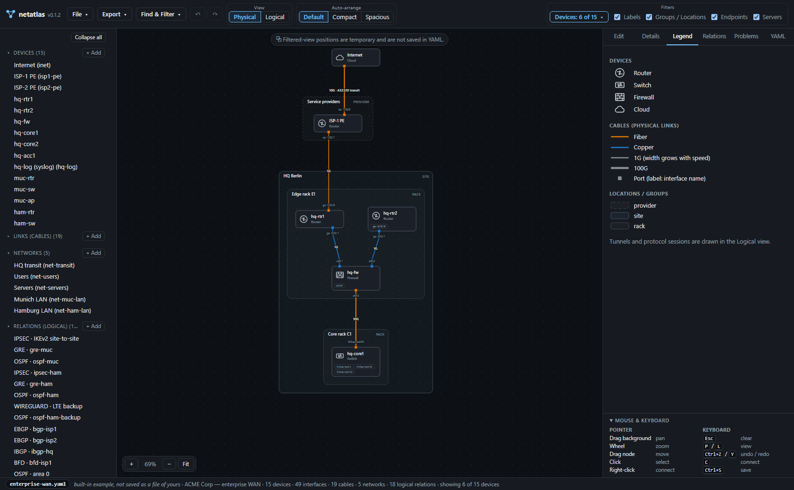
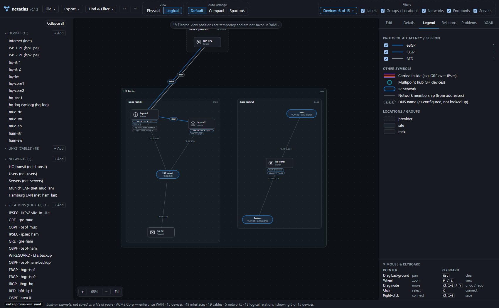

# NetAtlas

**NetAtlas — an explorable map of a network architecture.**

NetAtlas lets you create, edit and explore physical and logical network
diagrams from a single YAML file, entirely offline. The whole tool is one
self-contained HTML file, `dist/netatlas.html`, that runs in any modern
browser, including on an air-gapped machine. Start a new model or open a YAML
file, then:

* **Physical view:** devices, their ports (with interface names), cabling
  (medium, speed, and the networks each end carries), and
  locations such as sites, floors, rooms and racks, drawn as nested boxes.
* **Logical view:** IP networks with their members, device loopbacks,
  routing adjacencies, overlays, redundancy groups, services, and tunnels such
  as GRE and IPsec. Tunnels are drawn as hollow tubes; a relation carried over
  a tunnel (e.g. GRE over IPsec, OSPF over GRE) is drawn *inside* its tube.
* **Editor:** a model outline plus a property inspector. It can create,
  change and delete every part of the model: devices, their physical and
  logical interfaces (loopbacks, virtual interfaces, tunnel interfaces),
  links, networks, relations and tunnels, groups, protocol definitions,
  free-form attributes, and even keys the format doesn't define. Validation
  runs as you type, and the diagram updates immediately. **Save model** and
  **Save model as…** write the model as a portable YAML file. Right-click two
  endpoints in the diagram to cable them or relate them.

There's nothing to install, no server, and no network access. YAML remains
the model: the page reads it, edits it and writes it back.

**NetAtlas 0.1.2**, a usable initial version; see the
[changelog](CHANGELOG.md) for what it covers, and
[Limitations](#limitations-honest-list) for what it doesn't.

Two version numbers are involved, and they are independent:

* **0.1.2** is the version of the application, shown next to the logo.
* **1** is the version of the YAML model format. Every model file starts
  with `netatlas: 1`, and model format 1, described in
  [docs/FORMAT.md](docs/FORMAT.md), is the only format NetAtlas reads and
  writes. A missing `netatlas:` line, another value, or a key that isn't in
  the format is reported as an error; nothing is converted or guessed.

| Editor: outline, inspector with the device type, loopbacks; logical view | Physical view of the same network |
|---|---|
|  |  |

| Selecting the GRE tunnel: IPsec → GRE → OSPF in the logical view… | …and the cables it rides on in the physical view |
|---|---|
|  |  |

| All 15 device types, each with its own icon; the legend lists them by name | Data-center fabric: spines raised with `tier`, leaves, servers |
|---|---|
|  |  |

| **Auto-arrange**, physical: POP sites, customer, separate OOB island | **Auto-arrange**, logical: iBGP mesh between loopbacks, tunnels, devices kept in their groups |
|---|---|
|  |  |

| **Devices** filter, physical: six HQ devices, only their cables and frames | The same devices, logical: only the relations among them, groups framed |
|---|---|
|  |  |

**Auto-arrange** sits in the top toolbar as three options, **Default**,
**Compact** and **Spacious**, and arranges the view on screen. The option the
view is arranged with is shown selected (and is disabled: there is nothing to
do); after manual changes none is selected and all three can be used.

## Open it, create or load a model

1. Get `netatlas.html`: attach it from the
   [GitHub release](https://github.com/hafnerst/netatlas/releases), or take
   `dist/netatlas.html` from this repository (or build it, see *Build*).
   It's the only file you need. Open it in Chrome, Edge, Firefox or Safari. Double-click
   it, drag it into a browser window, or enter its `file:///…/netatlas.html`
   path in the address bar. (Don't open `src/index.html`: that's only the
   build template.)
2. The start screen offers three ways to begin:
   * **New model** creates an empty model and opens it in the editor; add
     objects with **+ Add** in the model outline on the left;
   * **Open model…** lets you pick a `.yaml` / `.yml` file. You can also
     drop a file onto that card, or anywhere on the page;
   * **Load example**: choose one of the built-in examples and press
     **Load**.

   The same commands are in the **File** menu at the top left at any time.
   A file that can't be read as netatlas YAML is not opened: the page says
   which file, where and why, and lets you open another one. If the current
   model has unsaved changes, you are asked before it is replaced.
3. Switch between **Physical** and **Logical** (or press `P` / `L`).
4. Click anything in the diagram or in the model outline on the left. The
   **Edit** tab on the right opens it in the inspector. With nothing
   selected, the Edit tab offers **Edit model settings** for the model as a
   whole (title, description).
5. Choose **File → Save model as…** (Ctrl+Shift+S) to save the model as a
   YAML file under a name and in a place you choose; from then on **File →
   Save model** (Ctrl+S) updates that file. See [Saving](#saving).

### The toolbar

| Control | What it does |
|---|---|
| **netatlas** logo and version | the application version (v0.1.2), not the model format version |
| **File ▾** | one menu for everything about models and their files: **New model**, **Open model…**, **Save model** (Ctrl+S), **Save model as…** (Ctrl+Shift+S), **Close model** and, under **Examples**, the built-in files. Every entry says *model*; an entry ends in “…” exactly when it asks for something before it acts (a file to open, a name and place to save to), and acts at once otherwise. *Save model* is available while the model is linked to a file it may write (see [Saving](#saving)); *Save model as…* and *Close model* whenever a model is open. *Save model* shows a small dot while there are unsaved changes. The example that is open is marked (*open*, or *open · modified*) until it is saved as a file of yours. The menu closes after a choice, with Esc, or when you click elsewhere; the arrow keys move through it. |
| **Export ▾** | One entry, **Export view as…**, which opens a submenu with **PNG** and **SVG**. Either saves the selected view (Physical or Logical) as a picture; see [Exporting pictures](#exporting-pictures). Greyed out until a model is open. The submenu opens when the entry is clicked or tapped, or with Enter, Space or the right arrow key; the left arrow key or Esc closes it. The menu works like **File**; the left and right arrow keys move between the two. |
| ↶ ↷ | undo and redo |
| **View: Physical** / **Logical** | the two views, in the group labelled *View*. The toolbar has three such groups, *View*, *Auto-arrange* and *Filters*: each has its label above its controls, inside the same subtle dashed frame. In a very short window (400 px high or less, e.g. strongly zoomed) the labels are hidden to leave room for the diagram; the frames stay, and the labels remain the groups' accessible names. |
| **Auto-arrange: Default · Compact · Spacious** | three ways to arrange the view on screen (see [Auto-arrange and positions](#auto-arrange-and-positions)). The label *Auto-arrange* sits above the three buttons, all in one dashed frame. The one the view is arranged with is selected and disabled; the others stay available |
| **Find & Filter ▾** | **Find in diagram…** (`/`): a search bar over the top right of the diagram, by id, label, address, prefix, protocol or cable id; Enter or a click selects a match in the diagram, Esc closes it. **Filter object list…**: a filter box at the top of the object list (the model outline on the left), which stays while it holds text; × or Esc clears and closes it. It narrows the list only; the diagram is not changed. Both are greyed out until a model is open; the menu works like **File** and **Export**. |
| **Filters: Devices ▾** (right) | the first control of the group labelled *Filters*, which holds every diagram filter below (Devices, Labels, Groups / Locations, Networks, Endpoints, Servers and the **Filters ▾** drop-down); which devices the diagram shows; all by default. Like every diagram filter on this row (and the **Filters ▾** drop-down), it is greyed out on the start screen and becomes available, with its default, once a model is open. Opens a list with a check box per device, a filter box, **Select all** and **Clear**. See [Showing part of the network](#showing-part-of-the-network). |
| **Labels** | cable, relation and address labels (on by default) |
| **Groups / Locations** | the frames of groups / locations, in both views (on by default). Hiding them never hides or moves a device. |
| **Networks** (logical view) | network nodes and their membership lines (on by default) |
| **Endpoints** / **Servers** | devices of type *Endpoint* (`endpoint`) and *Server* (`server`), in both views (on by default). Switching one off hides those devices and what only they connect, like deselecting them under **Devices**; see [Showing part of the network](#showing-part-of-the-network). Nothing is deleted. |
| **Filters ▾** | appears when the window is too narrow for all the switches: the diagram filters stay on one row, and the ones that don't fit (Servers first, then Endpoints, Networks, Groups / Locations, Labels) move into this drop-down. Its button says how many of them are off (*Filters · 1 off*). Arrow-down opens it from the keyboard, Esc closes it. In a narrow toolbar the logo drops its name. |

The bottom bar starts with the file name as a badge (a long name is shortened; hover for the whole name and how it is saved), with a small dot while the model has unsaved changes. It is followed by what the name stands for (*saved to this file*, *built-in example*, *new model*, *opened read-only*, or *copy downloaded as …, not linked to a file*), the model's title and counts, unsaved changes, problems and the filter state.

### The model outline

The panel on the left lists the model by section: devices, links, networks,
relations, groups and protocols. Each heading shows how many entries it has
and folds its section when clicked. **Links** and **Protocols** start folded;
**Collapse all** / **Expand all** at the top does all of them at once.
Folding only changes what is listed: a folded heading still shows the number
of problems inside the section and, when something is selected, how many of
its entries are related; the selected entry itself stays visible, the filter
(**Find & Filter → Filter object list…**) searches folded sections too, and **+ Add** opens the section it adds to.
While something is selected, the row of **Collapse all** says *▸ selected ·
• related (n)*. The list doesn't move when you select, switch or clear: every
entry keeps the place of its mark, and the panel keeps its width.

Files are read with the browser's File API, edited in memory and saved to a
file you choose (or downloaded, see [Saving](#saving)). They're never sent anywhere. The page's
Content-Security-Policy (`default-src 'none'`, `connect-src 'none'`) makes
network access impossible even in principle.

## Editing

| Task | How |
|---|---|
| Add an object | **+ Add** next to a section of the Model outline (devices, links, networks, relations, groups, protocols). A new object gets only a unique ID; **nothing else is chosen for you**. A device has no type, a group no kind, a network no prefix or VLAN, a protocol no category, a relation no protocol (fields show prompts such as *Select device type*). Until you fill them in, the missing required values (a relation's protocol and endpoints, a link's ends) are reported as errors. |
| The header | The top of the **Edit** tab names the object's type, says whether it has problems (*No problems*, or how many errors and warnings, listed below it) and holds **Duplicate** and **Delete** (red); the object's full name is on the line below. In a narrow panel the two buttons show their icon only; their names stay in the tooltip and for screen readers. |
| Duplicate | **Duplicate** on an object copies all its values and attributes under a new ID. |
| The form | Below the header, the **Edit** tab groups an object's fields into titled cards: *Identity* (ID, label, and the type or kind), then what fits the object (a device: *Placement*, *Notes*, its interface sections and DNS names; a link: *Ends* and *Cable*; a network: *Addressing* and *Members*; a relation: *Protocol*, *Endpoints* and *Underlay*; a protocol: *Drawing*), and *More* for attributes and keys the format doesn't know. Every field keeps its label, help and messages; nothing is hidden. |
| Details | The **Details** tab starts with the same header as **Edit**: type, problem state, the name and, beside it when it differs, the object's ID (selectable, to copy). Its content is in the same kind of cards: *Overview*, then the object's lists (interfaces, relations, members …). It is read-only and shows what is derived; the Edit tab is where values are changed. |
| Connect two endpoints | In the diagram, **right-click** a device or an interface, then right-click a second one: a new **physical link** (physical view) or **logical relation** (logical view) between the two opens in the Edit tab. See [Connecting in the diagram](#connecting-in-the-diagram). |
| Edit fields | Type in the inspector. A change is applied when you press Enter, leave the field, or click anything else, including the diagram. |
| Rename an ID | Edit the **ID** field. Every reference (links, endpoints, `over`, group parents, protocol names) is updated, and a notice says how many. |
| Interfaces | A device lists its interfaces in two categories. **Physical interfaces:** **+ Interface** adds a port; its **Type** is the read-only text *Physical*. **+ Port Range** next to it adds a numbered run of ports in one step (see [Port ranges](#port-ranges)). **Logical interfaces:** **+ Loopback**, **+ Virtual** and **+ Tunnel** add one of that type; the **Type** field offers exactly *Loopback*, *Virtual* and *Tunnel*. Each entry is a collapsible card with an address list, attributes, and what uses it. A card shows only the association that fits its type: **Member ports** (a virtual interface that is a bond: pick physical interfaces of the device), **VLAN ID** and the read-only **Ports carrying VLAN** (a VLAN interface), **Tunnel source** and **Tunnel destination** (a tunnel). There is no parent field. **Network / VLAN** and **Ports carrying VLAN** are *derived*: they can't be edited and change as soon as an address, a network or a link end changes. Cards are listed alphabetically within each category; the order in the YAML file is left as it is. Every card except a loopback's has a **DHCP** switch beside its addresses (see [DHCP and DNS names](#dhcp-and-dns-names)). |
| DNS names | After the two interface sections, **DNS names** lists the device's names. **+ DNS name** asks for the name and the interfaces it belongs to (by name; interfaces with DHCP on are not offered) and adds it only when both are valid. Each entry edits its name, adds interfaces from a picker and removes them (the last one can't be removed: delete the name instead). |
| Networks | A network is **one** prefix (**IP network (CIDR)**, required) and, optionally, the VLAN it lives in. **Members** is *derived*: every device with a configured interface or loopback address inside the prefix, listed once with the matching interfaces and addresses (an interface with DHCP on has no known address and counts for nothing). To add a member, give it an address in the network. The details also list the cables that carry the network. |
| Link-end networks | On a link, **End A networks** and **End B networks** each take any number of the model's networks, picked by name (with or without a VLAN; the VLAN is shown next to each). This says which networks the cable carries at that end — it is not membership, and several networks don't make the port "tagged". Each end is stored separately; if they differ, a warning shows the difference and nothing is changed for you. Speed and medium are set here too, and only here. |
| Endpoints | Device and interface pickers, alphabetical. A relation endpoint can use any interface (logical ones are labelled *loopback*, *virtual* or *tunnel*); a link end offers physical interfaces only. An endpoint is only a device and an interface; anything about an endpoint's part goes into the relation's attributes. |
| Direction | A switch on a relation: **Bidirectional** (the default; nothing is written to the file) or **Unidirectional** (`direction: unidirectional`): one way, from the first endpoint to the last, drawn with an arrow. Reorder the endpoints with ↑ to turn it around. |
| Carried over (underlay, `over`) | Pick links, relations or networks from the list: what the relation rides on, e.g. GRE over IPsec over two cables, or VRRP on the users network. A relation has no separate network field. |
| Protocol-specific settings | **attrs** on a relation (and on each endpoint): an editable tree of values, groups and lists of any depth |
| Keys the format doesn't know | Shown under **Other properties**. They're kept and exported, and reported as errors. Use **→ attrs** to move one into `attrs`. |
| Delete | **Delete** on the object. The dialog says how many references will break; broken references are then listed as errors, never removed silently. |
| Undo / redo | Toolbar arrows, or Ctrl+Z / Ctrl+Y (up to 100 steps) |
| Raw YAML | The **YAML** tab shows the model exactly as it will be exported. Edit and **Apply** (text that doesn't parse is rejected with its line number; unapplied text survives tab switches). The selected object's entry is marked with a band, and the line above the text says which lines it covers; selecting another object (in the diagram or a list) keeps the YAML tab open and moves the mark, scrolling only when the entry is out of sight. The entry is found by the object's ID in the parsed text, so other places that mention the ID are never marked; while the text doesn't parse, nothing is marked. The mark is not part of the text, and the whole file stays editable. |
| Problems | The **Problems** tab lists all errors and warnings; click one to jump to the object. Objects with errors get a red badge in the outline and a dashed red outline in the diagram. The inspector shows each message under the affected field. |

### Saving

A model is saved as a YAML file. Two entries of the **File** menu do it, and
both are always there:

| Entry | What it does |
|---|---|
| **Save model** (Ctrl+S) | Writes the model to the file it is **linked** to, at once: no file name is asked and NetAtlas shows no confirmation (the browser may ask once for permission to write). Available only while the model is linked to a file the page may write. |
| **Save model as…** (Ctrl+Shift+S) | Lets you choose a file name and place, saves the model there, and **links** the model to that file, so the next *Save model* updates it. |

A model is linked to a file only when the browser gives the page a file it
may write: after **Save model as…**, or after **Open model…** or a drop in a
browser that hands the page the file itself (Chrome, Edge and other
Chromium-based browsers, through the File System Access API). A **new model**,
an **example**, and a file read in any other way (the file picker of Firefox
or Safari, most drops) are not linked: *Save model* is greyed out and says
why, and *Save model as…* saves them. Ctrl+S then does *Save model as…*.

**Browsers that can't save to a chosen file** (Firefox, Safari): *Save model
as…* says so and offers to **download a copy** as a YAML file into the
browser's downloads location, under a name you can change (an opened file is
offered as `<original>-edited.yaml`; the file on your disk is not changed).
The copy is **not linked**: *Save model* stays unavailable, and the status bar
says *copy downloaded as …, not linked to a file*. If the model has validation
errors, the dialog lists them and the button becomes **Download anyway**.

**When saving doesn't happen**, nothing is lost: closing the save picker saves
nothing and says so; a write the browser refuses (permission denied) or that
fails (a full disk, a file that went away) is reported with the reason, every
change stays in the page, and the model stays marked as modified. A refused
permission also ends the link, so *Save model* is greyed out and *Save model
as…* is offered instead.

**Unsaved changes.** The file name in the status bar gets a small dot, the
status bar says "unsaved changes", the title gets a ●, and *Save model* shows a
dot. The state is a comparison with what was opened or last saved: undoing back
to that state makes the model unmodified again, redoing modifies it. **New
model**, **Open model…**, the examples and dropping a file all ask first
(*Cancel* / *Save first* or *Save as first…* / *Discard changes*). Closing or
reloading the tab triggers the browser's own "leave page?" prompt.

**Close model** (File menu) returns to the start screen. A model without
unsaved changes closes at once. Otherwise you choose: **Save and close** (a
linked model) or **Save as and close…** saves first, **Discard changes**
closes without saving, **Cancel** keeps the model and the editor exactly as
they are; a cancelled or failed save keeps the model open. Closing also
clears the selection, the view, filters and zoom, so the next model starts
clean.

**The open example** is marked in the **File** menu (*open*, and *open ·
modified* while its model has unsaved changes). Once it is saved with *Save
model as…* to a file of yours, it is that file, no longer the example. A
downloaded copy doesn't change that: the example stays marked and the status
bar says that a copy was downloaded. Opening another example or model,
**New model** and **Close model** clear or move the mark.

### Exporting pictures

**Export → Export view as…** opens a submenu with two formats:

| Format | What you get |
|---|---|
| **PNG** | A bitmap image, drawn at twice the diagram's size so text stays sharp, on the diagram's background colour. For documents, chats and slides. |
| **SVG** | A vector drawing that stays sharp at any size and can be opened in a browser or a drawing program. |

Both are made from the same picture, so they show the same thing:

* **the view that is selected**, Physical or Logical; the other view is
  exported by switching to it first;
* **the whole diagram**, whatever part of it is on screen: zooming and
  panning don't change the export, and a margin around the content keeps
  anything from being cut off;
* **every label in full**, as on screen;
* the **legend** and the **Networks** overview of that view, beside the
  diagram ([Networks in exported pictures](#networks-in-exported-pictures)).

The file is named after the model and the view, for example
`enterprise-wan-logical.png`, and lands in the browser's downloads location.
A short message confirms the export. The picture is produced inside the page;
nothing is sent anywhere.

A browser can only draw images up to a certain size. A very large diagram is
therefore drawn at less than twice its size (the message says at what scale)
so that the whole picture still fits; the SVG has no such limit. If an export
fails, a dialog says which file could not be created and why, and nothing is
downloaded.

### Port ranges

**+ Port Range** in a device's *Physical interfaces* section asks for a
**From** and a **To** name and creates every port in between:

* The last number of each name is the port number; everything before it must
  be identical in both names. `ge 1/1` to `ge 1/24` gives `ge 1/1`, `ge 1/2`
  … `ge 1/24`. A number written with leading zeros keeps its width (`port01`
  … `port12`).
* The dialog shows the ports it will create while you type, and **Create**
  stays disabled until the range is valid. It is rejected as a whole, with
  the reason, if a name has no number at the end, the two prefixes differ,
  the first number isn't lower than the last, a name or id already exists on
  the device, or the range has more than 256 ports (512 interfaces per
  device in total).
* Only physical interfaces are created: no addresses, VLANs or links. An
  interface id can't contain spaces, so `ge 1/1` gets the id `ge-1/1` and
  keeps the name as typed as its label; a name that is already a valid id
  (`ge-0/0/1`) needs no label.
* The whole range is one undo step, and the new ports appear in the usual
  alphabetical order.

**Drafts are allowed.** A file with validation errors (broken references, a
loopback without an address, …) opens and is drawn as far as it's valid, so
you can repair it in the editor. Only input that isn't valid YAML in the
supported subset is refused before editing, with the line number.

### Physical and logical interfaces

A device stores each interface once, in one of two lists:

* `interfaces`: its **physical interfaces** (ports). They have no type to
  choose, and only they can be cabled.
* `logical_interfaces`: its **logical interfaces**, each with a `type`:
  `loopback`, `virtual` (a VLAN interface, a bond, a subinterface, a VTEP …)
  or `tunnel`.

Logical interfaces are not nested under ports and have no generic "parent"
field. Each kind of association is modelled by what it means:

| Interface | What you enter | What is derived |
|---|---|---|
| Loopback | its addresses (with prefix length) | — (it has no physical parent) |
| Bond / aggregate (`virtual`) | **Member ports**: `members: [eth0, eth1]`, physical interfaces of the same device | highlighting of the ports and their cables |
| VLAN interface (`virtual`) | its VLAN: `vlan: 10`, or nothing if its address lies in a network that defines the VLAN | **Ports carrying VLAN**: the device's ports whose link end permits that VLAN |
| Any other `virtual` interface | nothing | nothing; no association is assumed |
| Tunnel | **Tunnel source** (any interface of the device, physical or logical, or an address) and **destination** (an address, a device or `device:interface`) | the source interface when an address is written; highlighting of source and destination |

Relations can use any interface as an endpoint. **Every interface of a shown
device is drawn**, so it can be found, selected and connected: in the
physical view, a cabled port sits on its cable and a port without a cable is
a small chip in a strip at the bottom of its device box (a long run of
similar names, such as `ge-0/0/1` … `ge-0/0/24`, writes the shared prefix once,
`ge-0/0/ ▸`, and each chip its own number; the full name is in the tooltip).
In the logical view, loopbacks are rows under the device (every one of them),
and virtual and tunnel interfaces are chips under the loopbacks, whether or
not a relation uses them. Logical interfaces are never drawn as ports, and
physical interfaces don't appear in the logical view. A device has no vendor, model, role, management-address or router-ID
field; keep such facts as free-form attributes if you need them. The full
rules are in [docs/FORMAT.md](docs/FORMAT.md#interfaces).

### DHCP and DNS names

**DHCP.** Every physical interface and every virtual or tunnel interface
has a **DHCP** switch next to its addresses. It is off for every new
interface, and an interface without addresses is *not* assumed to use DHCP:
only `dhcp: true` in the file means DHCP (omitted means off).

* A loopback can't use DHCP: its card has no switch, and `dhcp: true` on a
  loopback in a file is an error. (The switch appears on such a card only
  so that it can be turned off.)

* While DHCP is on, the address list is greyed out and can't be edited. An
  interface never has DHCP and manual addresses at the same time; a file
  that says both is reported as an error, and neither value is dropped.
* Turning DHCP on for an interface that has addresses, or DNS names, first
  shows what will be deleted. **Cancel** changes nothing; confirming deletes
  them and turns DHCP on in one undo step.
* Turning DHCP off makes the address list editable again. The deleted
  addresses do not come back (Ctrl+Z does).
* DHCP is not an address. NetAtlas does not know which address the interface
  will obtain, so the interface belongs to no network and has no derived VLAN
  until an address is written.

**DNS names.** A device's DNS names are listed after its interfaces. A name
is entered once and associated with one or more interfaces of the device,
physical or logical; the file stores the interface ids, the editor shows
their names.

* Only interfaces with DHCP off can be chosen. If turning DHCP on would
  break an association, the confirmation names it and it is removed in the
  same step; a name left without interfaces is deleted with it. Deleting an
  interface removes its associations the same way, and renaming it updates
  them, so a name never points at a missing interface.
* The association is to the interface, not to one of its addresses. When an
  interface has several addresses, the editor says so.
* Only the name is configured: no A or AAAA record is derived or created.
* Names are checked: host-name syntax, one entry per name on a device (case
  and a trailing dot don't make a different name), existing interfaces, at
  least one interface. The same name on two devices is a warning.
* The **Details** tab of a device lists its names and their interfaces.
  **Find in diagram…** finds a device by its DNS name.
* The **Logical** view writes a device's names under it (and its loopback
  chips), each name once however many interfaces it belongs to, in a dashed
  chip; long names continue on a second line, and more than two end in
  *+n more names*. They follow **Labels** and the device filters and are in
  the logical PNG and SVG exports; the legend calls them *DNS name (as
  configured, not looked up)*. The physical view doesn't show them.

### What round-trips

Everything the file contains survives **load → edit → export → reload**,
including attributes no diagram shows, unknown keys, nested structures,
comments, key order and quoting style. Indentation is normalized to 2 spaces
and `>` blocks become `|` blocks with the same value. The example files are
written back byte-for-byte. The details are in
[docs/YAML-SUBSET.md](docs/YAML-SUBSET.md#writing-yaml-export-from-the-editor).

## Working with the diagram

| Action | How |
|---|---|
| Pan / zoom | drag the background; mouse wheel; `+` `−` `Fit` buttons; arrow keys, `+`, `-`, `0` |
| Select | click any device, port, interface chip, loopback, cable, tunnel, hub or network. The **Edit** tab opens it (an interface opens with its card unfolded); **Details** gives a read-only summary. A left click only ever selects. |
| Connect | **right-click** a device or an interface, then a second one (or select one and press **C**): see [Connecting in the diagram](#connecting-in-the-diagram). |
| Highlight | selecting something dims everything unrelated. For a tunnel this includes its carriers, what it carries, its endpoints and, in the physical view, **the cables it rides on**. The selection is kept across views. |
| Selection context in the lists | the element lists on the left and the **Relations** tab show the same selection: the selected entry is marked **▸** (bold, with a bar), entries **directly** related to it are marked **•**, and all others are greyed out but stay readable, clickable and keyboard-focusable. Select from either list or the diagram; `Esc` clears it. See *Which entries count as related* below. |
| Hover | tooltip with a short summary |
| Rearrange | drag devices or networks. The position is stored in the model (one undo step each) and exported with it. In a [filtered view](#showing-part-of-the-network) the move is temporary and not stored. |
| Auto-arrange | **Default**, **Compact** or **Spacious** in the top toolbar (`A` is Default): recomputes the positions of the **whole model** in the view on screen. The other view is not changed. If the view has positions you set by hand, it asks before replacing them. In a filtered view it arranges the shown devices only, temporarily. The option the view is arranged with is selected; see [Auto-arrange and positions](#auto-arrange-and-positions). |
| Find | **Find & Filter → Find in diagram…** or `/`: ids, labels, IP addresses, CIDRs, protocols, cable ids |
| Filter | **Devices** (top right): show only some devices. **Endpoints** / **Servers**: hide the devices of that type. **Legend** tab (logical view): turn protocols on and off. Top-right toggles for **Labels**, **Groups / Locations** and (logical view) **Networks**. |
| Export picture | **Export → Export view as… → PNG** or **SVG** in the toolbar saves the selected view (Physical or Logical) as a picture; see [Exporting pictures](#exporting-pictures). The picture always contains the **legend** of that view (device types, cable media and speed, locations; or protocols and line styles) and, in a second box beside it, a **Networks** overview. Both are drawn to the right of the diagram so they cover nothing, and the picture is enlarged to include them. They list what is drawn: protocols you have hidden are left out. See [Networks in exported pictures](#networks-in-exported-pictures). |

### Which entries count as related

The lists mark an entry as related only if the model references it directly
from the selected entry, or the other way round. Something reachable only
through another object stays greyed out. For example, the router at the other
end of a switch's cable is two steps away (switch → cable → router).

| Selected | Directly related |
|---|---|
| Device | its own group (not the enclosing ones), its cables, networks containing one of its addresses, relations with it or one of its interfaces as an endpoint |
| Port (in the diagram) | selects its device; related are the cable on that port, the networks containing an address of that interface, and the relations that name exactly that interface |
| Link (cable) | its two devices, the networks its ends carry, relations carried directly over it |
| Network | its member devices (derived from addresses), the cables that carry it at an end, relations carried directly over it |
| Relation | its endpoint devices, what it is carried `over`, relations carried over it, and its protocol if that is defined in the file's `protocols:` section |
| Group | its parent group, its sub-groups, devices placed directly in it |
| Protocol | relations using exactly that protocol id (aliases such as `ebgp` → `bgp` don't count) |

The rule is symmetric: if A is related to B, then B is related to A. The
diagram highlights at least these entries. It also highlights path context
that the lists don't count as direct:
* the devices at both ends of a highlighted cable or relation;
* the full underlay path of a tunnel, e.g. the cables under GRE-over-IPsec;
* everything inside a selected group.

Both come from the same model references, in `src/model/queries.ts`
(`selectionContext` and `relatedRefs`).

## Connecting in the diagram

Two endpoints are connected with the right mouse button; the left button only
selects.

1. **Right-click** a device or an interface: a port (cabled or a chip) in the
   physical view, a loopback row or interface chip in the logical view. That
   endpoint is marked, a dashed line follows the pointer, and the endpoints it
   can be connected to are marked (green, dashed outline); the others are
   faded. Endpoints that can start a connection show a context-menu pointer
   and say so in their tooltip.
2. **Right-click** a second, marked endpoint: a new **physical link**
   (physical view) or **logical relation** (logical view) opens in the
   **Edit** tab with both endpoints filled in and the cursor in its **ID**
   (a suggestion, selected). It is **not in the model yet**: fill in what is
   required (a relation's **protocol**), optionally a label, medium and speed,
   or direction, and press **Create link** / **Create relation** (or Enter).
   Create stays disabled, with the reason under the field, while something is
   missing or invalid. **Cancel** (or Esc, or selecting another object)
   discards it.

A right-click on an endpoint that can't be used creates nothing: a short
message says why, and the first endpoint stays chosen. **Esc** cancels an
unfinished connection; switching views, opening, creating or closing a model
cancels it too. A right-click anywhere else (the background, a cable, a label)
keeps the browser's own menu.

**From the keyboard:** select a device or an interface (in the diagram, a list
or with Find) and press **C**. A bar over the diagram lists the compatible
endpoints that are shown; pick one and press Enter (or **Use endpoint**). Esc
or **Cancel** stops.

**What can be connected** follows the format's rules:

| | Physical view: link | Logical view: relation |
|---|---|---|
| An endpoint | a device (the whole device: no port is chosen for it) or one of its **physical** interfaces | a device or one of its **logical** interfaces (loopback, virtual, tunnel) |
| Not offered | logical interfaces; a port that **already has a cable** (one cable per port) | physical interfaces (they aren't drawn there) |
| The pair | two different endpoints; on one device only two of its ports (never a device to itself or to its own port) | endpoints on two different devices |
| Repeats | several cables between the same two devices are fine | an interface may take part in **any number of relations**; only a relation that repeats an existing one is refused: same endpoints (in order, if unidirectional), protocol, label and direction, and the existing one has no underlay or attributes of its own. Another label, protocol or direction makes it a different relation. |

The new object uses stable references (`"device:interface"`, or the device id
for a device end), is validated like everything else, is one undo step, marks
the model as modified, and is part of exports. Every relation is drawn as its
own lane and can be selected on its own, also when several share the same
endpoints.

## Auto-arrange and positions

**Auto-arrange** sits in the top toolbar, next to *Physical* / *Logical*, as
three options: **Default**, **Compact** and **Spacious** (`A` is Default).
Each lays out the entire model **in the view on screen**, not just what is
visible or selected; it includes objects hidden by the Legend's protocol
switches. The other view keeps its positions; to arrange it, switch to it and
choose an option there. The result is one undo step (Ctrl+Z). It never runs by
itself. In a view filtered to some devices it does something else: see
[Showing part of the network](#showing-part-of-the-network).

| Option | What it does | Good for | Trade-off |
|---|---|---|---|
| **Default** | The layout described below: tiers and groups by cabling (physical), evenly spaced relations (logical). The initial layout of every model. | most diagrams | — |
| **Compact** | The Default layout with the empty space taken out: shrunk towards its middle, then pushed apart again just enough that no two devices, networks or group frames (with their titles) overlap. Each group is compacted as a whole, so frames stay intact and rows and stacks keep their order. | small architectures that should fit one screen or slide | cable and relation labels have less room and sit closer to their lines |
| **Spacious** | The Default layout spread out from its middle (by 1.4). Distances only grow, so nothing comes to overlap. | dense architectures with many labels and parallel lines | a larger picture; more zooming |

In the logical view, every option keeps the devices of each group / location
together and draws the group's frame around them, as in the physical view;
networks and multipoint hubs are placed around the groups.

**Which option is selected** is decided by the positions, not by the last
button pressed: the option whose result the view on screen shows is selected
(`aria-pressed`) and disabled, as there is nothing to do; the others stay
available. When two options give exactly the same positions for a model (a
single device, for example), the first of Default, Compact, Spacious is the
selected one, and the others are disabled too and say that they give the same
positions. After manual moves or edits, none is selected and all three can be
used. A message (the group's hover text and accessible description) says
which applies.

There is no dialog unless something of yours would be lost:

* If the view only differs because the model was edited after arranging, it
  is arranged at once.
* If the view has **positions that were set by hand**, a confirmation names
  the objects concerned, says that they move to the calculated layout, that
  the other view is not changed, and that the step can be undone. **Cancel**
  leaves both views exactly as they are.

| Status | Message | Meaning |
|---|---|---|
| an option is selected | *The physical view is arranged with Compact.* | **Auto-arranged.** Every object is exactly where that option puts it for the current model. |
| none selected | *This view has manually adjusted positions. Each Auto-arrange option replaces them after a confirmation.* | **Manually adjusted.** Some objects were dragged away from their calculated positions. |
| none selected | *This view no longer matches an Auto-arrange option: the model was edited after it was arranged.* | **Edited since arranged.** The model changed after arranging (e.g. a device was added). Existing objects kept their positions and new ones were placed next to their neighbors. Nothing was moved by hand. |

The status is **derived from the document every time**: it compares the
current positions with the deterministic result of each option for the
current model. So it's correct after undo/redo, after export and reload, and
when objects are back at their calculated positions. Physical and logical
views are tracked separately. Ordinary model edits never count as manual
adjustments.

The Default layout:

* **Physical view:** sites, racks and other groups become nested boxes;
  devices sit in rows by tier (WAN/cloud on top, then routers, firewalls,
  core, access, servers). Groups are placed by their cabling: a group lies
  one layer below the block it is cabled to and as close as possible to the
  point under the devices it connects, so its cables are short and steep.
  A provider group between a cloud and the routers it feeds ends up between
  them; no group kind or name decides this. Disconnected parts are kept
  apart, and rows are ordered to reduce crossings.
  Cables between ports that face each other are straight, parallel cables
  stay parallel, and a cable bends around a device instead of crossing it.
* **Logical view:** each connected part of the logical graph is laid out
  with evenly spaced graph distances. Crossings, and lines passing through
  devices, are reduced. Devices keep room for parallel relation lanes and
  their labels, and separate components are packed apart. Tunnels (tubes),
  adjacencies, overlays and cables remain visually distinct.
* **Sized for the text:** nothing is shortened with "…". Labels wrap (line
  breaks in a label are kept), boxes grow to fit them, and Auto-arrange
  leaves room for port labels, cable labels and relation labels. Every label
  gets its own free place. The rules and their limits are in
  [docs/FORMAT.md](docs/FORMAT.md#sizes-labels-and-routes).
* **Deterministic:** the same model gives the same positions with each
  option, whatever you loaded, selected or moved before. YAML key order and
  list order don't matter, and arranging twice with the same option moves
  nothing the second time. Compact and Spacious are computed from the Default
  result, so they are just as reproducible.
  "Equivalent input" is defined exactly in
  [docs/FORMAT.md](docs/FORMAT.md#auto-arrange).

**Positions live in the YAML**, in an optional `layout:` section
(`id: [x, y]` per view). It's presentation only: it never changes the
network, and a broken entry is only a warning.

* **Exported YAML stores the coordinates** once there are any to store.
  Opening a file never writes positions: without a `layout` section the
  diagram shows the auto-arranged layout (*Auto-arranged*).
* When you drag a node, or make the first edit that changes the geometry
  (adding, removing or renaming objects, changing labels, groups, cables or
  relations), the positions currently shown are stored. From then on nothing
  moves by itself; new objects are placed next to their neighbors.
* Dragged nodes are also listed in `layout.manual`, which is how
  *Manually adjusted* is told apart from *Edited since arranged* after a
  reload. Auto-arrange clears that list for the arranged view, and a node
  dropped exactly on the position an option gives it leaves it.
* Load → Auto-arrange → export → reload shows exactly the same diagram with
  the same status.

The complete rules are in [docs/FORMAT.md](docs/FORMAT.md#layout-diagram-positions).

## Showing part of the network

**Devices ▾** at the top right of both views chooses which devices the
diagram shows; every device is selected by default. Use it to look at, or
export, one site, one rack or one service without changing the model.

* **Select or deselect** devices with their check boxes (the filter box
  narrows the list, it doesn't change the selection). **Select all** returns
  to the complete diagram; **Clear** deselects everything. The button shows
  *Devices: 6 of 15* while a filter is active, and so does the status bar.
* **What is shown:** the selected devices; cables whose two ends are
  selected; relations whose every endpoint is selected (a relation that also
  reaches a hidden device is left out, never drawn as if it were complete);
  networks that a selected device has an address in, plus networks whose
  VLAN a shown cable carries (physical view) or that a shown relation names
  (logical view); only their selected members; groups that contain a
  selected device, framing only those; protocols that a shown relation uses.
  The full rules are in [docs/FORMAT.md](docs/FORMAT.md#filtered-views).
* **Layout:** a filtered view is auto-arranged for the selected devices. The
  result depends only on the model and the selected devices, not on the
  order you picked them in or on earlier moves. It is not re-arranged when
  you change Labels, select something or switch views.
* **Positions are temporary.** A note above the diagram says so:
  *Filtered-view positions are temporary and are not saved in YAML.* You can
  drag nodes to tidy a picture for export; that changes nothing in the
  model, adds no undo step, and each view keeps its own moves. **Select
  all** brings back the complete diagram with its saved positions,
  unchanged. Only the complete diagrams' positions are ever saved.
* **Auto-arrange** (any of its three options) in a filtered view re-arranges
  the shown devices at once (no confirmation: the positions are temporary);
  the saved layout is not touched. The option the filtered view is arranged
  with is selected and disabled, as in the complete view.
* **Export** saves what the filtered view shows: the selected devices and
  what belongs to them, with the current Labels / Groups / Networks
  settings, the whole filtered diagram (not just the part on screen), a
  legend of what is drawn and a Networks overview of the networks relevant
  to it. The note about temporary positions is not in the picture.

### Endpoints and Servers

**Endpoints** and **Servers** next to **Labels** hide the devices of type
`endpoint` and `server` in both views, and in their exports. They are on
for every model you open.

* Hiding a type works like deselecting its devices: their cables and the
  relations that reach them go too, by the same rules as above.
* They combine with **Devices**: the diagram shows the selected devices that
  are not of a hidden type. The selection itself is not changed; the
  **Devices** list still ticks a hidden device and says *hidden: Server off*,
  and the counts (*Devices: 2 of 17*, status bar) say what is shown.
* The other devices stay where they are. Switching the type on again brings
  back exactly the earlier selection, with its devices in their places;
  when that is every device, the complete diagram returns with its saved
  positions. Nothing is written to the model or the YAML file.

## Networks in exported pictures

Every exported SVG has, next to the legend, a box titled **Networks —
physical view** or **Networks — logical view**, in the legend's style. It
lists the networks that are relevant to that picture: each with its name,
its prefix and, if it has one, its VLAN (and its id when two listed
networks share a name). Entries are sorted by name. Long names wrap, a long list continues in further columns, and a picture
without relevant networks says so.

Relevance comes from what the picture actually shows, not from the list of
networks in the file:

| Drawn in the picture | Networks it brings in |
|---|---|
| a network node (logical view, *Networks* switched on) | that network |
| a port on a cable (physical view) | networks containing an address of that physical interface, of an aggregate it is a member of, or of a virtual interface whose network it carries |
| a cable (physical view) | the networks assigned to either of the cable's ends |
| a device with loopbacks (logical view) | networks containing an address of those loopbacks |
| a relation (logical view; hidden protocols don't count) | the networks in its `over`, and the networks containing an address of its endpoint interfaces |

So the physical picture doesn't list a network that is only reached through
loopbacks, tunnel interfaces or an uncabled interface, and a logical picture
with *Networks* switched off lists only what its relations and loopbacks
use. The chips of interfaces without a line of their own (uncabled ports,
virtual and tunnel interfaces) are in the picture, but they name an
interface only and bring no networks in. The box is not drawn on screen; the **Networks** section of the model
panel and the details show the networks there.

## The YAML model in brief

```yaml
netatlas: 1
title: Minimal example
devices:
  - id: r1
    type: router
    interfaces:                          # physical interfaces (ports)
      - {id: eth0, ip: 192.0.2.1/30}
    logical_interfaces:                  # loopback, virtual and tunnel interfaces
      - {id: lo0, type: loopback, label: Router ID, ip: [10.255.0.1/32, 2001:db8:ffff::1/128]}
      - {id: tun0, type: tunnel, source: eth0, destination: r2:eth0}
  - id: r2
    type: router
    interfaces:
      - {id: eth0, ip: 192.0.2.2/30}
    logical_interfaces:
      - {id: tun0, type: tunnel, source: eth0, destination: 192.0.2.1}
links:                                   # physical cabling only; speed and medium live here
  - {id: cable-1, a: "r1:eth0", b: "r2:eth0", medium: copper, speed: 1G}
networks:                                # IP networks; r1 and r2 are members through their addresses
  - {id: transfer, cidr: 192.0.2.0/30}
relations:                               # everything logical
  - {id: gre-1,  protocol: gre,  endpoints: ["r1:tun0", "r2:tun0"], over: cable-1}
  - {id: ospf-1, protocol: ospf, endpoints: ["r1:tun0", "r2:tun0"], over: gre-1}
```

* **Stable identifiers.** Groups, devices, links, networks and relations have
  ids that are unique across the file. Every interface is addressed as
  `device:interface`.
* **Two categories of interfaces.** `interfaces` holds the physical ones,
  `logical_interfaces` the loopback, virtual and tunnel interfaces. A bond
  lists its `members`, a VLAN interface names its `vlan` (its ports are
  derived from the links), a tunnel names its `source` and `destination`.
* **Physical vs logical is explicit.** `links` are cables between ports.
  Logical interfaces can't be cabled.
  `relations` are protocol sessions, tunnels, overlays, redundancy groups and
  service dependencies. `over:` says what a relation rides on.
* **Configure once, derive elsewhere.** A network has one prefix and,
  optionally, a VLAN; its members are whoever has a configured address
  inside (IP containment). An interface's VLAN is the VLAN of the network
  containing its address. Speed and medium belong to the link. Each end of a
  link lists the networks the cable carries there (physical / L2 carriage,
  not membership, no tagging implied). A relation's `over` names what it
  depends on. Derived values are shown read-only and are never written to
  the file. The
  [table of sources](docs/FORMAT.md#configure-once-derive-elsewhere) has the
  details.
* **Open protocol set.** `protocol:` accepts any name. About 40 common
  protocols are built in. New ones can be styled in a `protocols:` section.
  Protocol-specific settings go in free-form `attrs`.
* **Six drawing categories:** `tunnel` (tube), `adjacency` (solid),
  `overlay` (dashed), `redundancy` (dotted), `service` (dash-dot), `other`.

The complete reference is **[docs/FORMAT.md](docs/FORMAT.md)**, and the exact
YAML that is read and written is in
**[docs/YAML-SUBSET.md](docs/YAML-SUBSET.md)**.

### Examples

| File | Shows |
|---|---|
| [`examples/enterprise-wan.yaml`](examples/enterprise-wan.yaml) | HQ with two ISPs and two branches. **IPsec → GRE → OSPF** stacks over the same internet uplinks that also carry eBGP and BFD. WireGuard backup over LTE, tunnel interfaces that name their source port and destination, a port-channel with two member ports, VLAN interfaces whose ports are derived from the networks the cables carry, loopbacks used by iBGP, a multipoint OSPF area, VRRP, LACP, syslog, an undeclared protocol and a user-defined one (MACsec). IP networks with derived members, two of them with a VLAN, cables that carry the users and servers networks at both ends, and OSPF and VRRP over their LAN segments. |
| [`examples/datacenter-evpn.yaml`](examples/datacenter-evpn.yaml) | Spine/leaf fabric in racks: eBGP underlay, EVPN sessions between loopbacks, a multipoint VXLAN VNI, MLAG, LACP, and a user-defined `srv6` tunnel. The tenant network's members are the leaves' VLAN interfaces, which carry the VRF; each leaf also has a VTEP, a virtual interface that is neither a bond nor a VLAN interface. |
| [`examples/minimal.yaml`](examples/minimal.yaml) | Two routers, one cable, a tunnel interface on each router sourced from its port, OSPF inside GRE. |
| [`examples/metro-ring.yaml`](examples/metro-ring.yaml) | **Representative architecture for Auto-arrange.** Six PE routers in three POPs on a fibre ring, IPv4/IPv6 loopbacks (iBGP and RSVP-TE endpoints), an OSPF area, LDP per link, a dense 15-session iBGP mesh, TE tunnels, an L3VPN overlay, customer eBGP, a disconnected out-of-band network and an unconnected spare router. No stored positions. |
| [`examples/device-types.yaml`](examples/device-types.yaml) | **Every device type.** A campus with internet edge, VPN gateway, firewall, inline IPS, a DMZ with load balancer and proxy, core/access switching with Wi-Fi and endpoints (the access switch has six free ports, drawn as chips), and a server room with a hypervisor, a VM, a container, NAS and a monitoring appliance. |
| [`examples/long-labels.yaml`](examples/long-labels.yaml) | **Sizing test case.** Device labels with line breaks, a very long label, a long host name without spaces, a long group title, three parallel cables, long cable labels (a cable carrying three networks), one segment as three networks (IPv4 and two IPv6 prefixes, one VLAN), and six labelled relations between the same two devices (three of them nested). Nothing is shortened. |
| [`examples/broken/errors-demo.yaml`](examples/broken/errors-demo.yaml) | Intentionally invalid, to show error reporting. It opens as a draft you can fix. |

The six valid files are the examples of the **File** menu.

Three more files, in `test/fixtures/`, are generated test data. They are not
examples and the application doesn't offer them: `editor-new-network.yaml`
(a model built from *New model* with the editor's operations),
`minimal-edited.yaml` (`minimal.yaml` imported and edited) and
`metro-ring-arranged.yaml` (`metro-ring.yaml` after Auto-arrange in both
views). `scripts/make-fixtures.mjs` produces them with the same editing core
the page uses; tests check that they're up to date, and the in-browser
self-test checks that the browser computes the same positions.
The browser self-test (below) also builds a model and edits an imported one
through the real UI. It saves the files it "downloaded" in
`dist/selftest-downloads/`.

## Supported YAML (summary)

Supported: block mappings and sequences, plain and quoted scalars, `|` and `>`
block scalars, single-line flow `[…]` / `{…}`, comments, and one document.
Scalars follow the YAML 1.2 core schema; `yes`/`no` are strings.

**Rejected with a line-numbered error, before editing:** anchors and aliases,
merge keys, tags, directives, multiple documents, complex keys, multi-line
plain or quoted scalars, multi-line flow collections, tabs in indentation,
and duplicate keys. Input is limited to 2 MiB, 100k lines, depth 32 and 250k
nodes. Details are in [docs/YAML-SUBSET.md](docs/YAML-SUBSET.md).

## Build

Requirements: Node.js ≥ 18. The only dependency is the TypeScript compiler
(a devDependency). There are no runtime or application-library dependencies.

```sh
npm install        # installs typescript only
npm run build      # -> dist/netatlas.html
```

`npm run build` does three things:

1. `scripts/gen-examples.mjs` embeds `examples/*.yaml` into
   `src/generated/examples.ts` for the **Examples…** menu.
2. `tsc` compiles `src/**/*.ts` to CommonJS JavaScript in `build/js/`.
3. `scripts/build.mjs` bundles those modules into one inline `<script>`. It's
   a small wrapper that refuses any non-relative `require`. It then inlines
   `src/styles.css` into `src/index.html` and writes
   **`dist/netatlas.html`**. The browser never sees or compiles TypeScript.

To regenerate the test fixtures after changing the editing core, run
`node scripts/make-fixtures.mjs`. Use `--check` to only verify them.

To retake the README screenshots in `docs/img/` after a UI change, run
`node scripts/readme-screenshots.mjs` after `npm run build`. It needs Chrome,
Edge or Chromium and uses the page's deep links
(`#example=<n>&view=<physical|logical>&select=<ref>&devices=<id,…>`).

### Is the checked-in HTML current?

`dist/netatlas.html` is committed so that it can be used without building.
To confirm that it was generated from the current source:

```sh
git status --short        # 1. clean working tree (no local edits)
npm ci                    # 2. the pinned TypeScript version
npm run check:dist        # 3. rebuild in memory and compare byte-for-byte
```

`check:dist` regenerates `src/generated/examples.ts` and the bundle in memory
and writes neither file. It prints the sha256 of the result, and exits with
status 1 if either committed file differs. The build is deterministic, so the
same source always gives the same file. `npm test` checks this too.

## Verification

```sh
npm test                    # build + all automated tests (Node + headless browser)
npm run check:dist          # is dist/netatlas.html generated from the current source?
npm run selftest:browser    # only the in-browser end-to-end test (verbose)
npm run selftest:viewport   # only the viewport check, at ten window sizes (verbose)
node scripts/browser-selftest.mjs --shot   # also writes screenshots to dist/screenshots/
```

| Area | Where | What is checked |
|---|---|---|
| Parsing | `test/yaml.test.mjs` (19 tests) | Every supported construct; rejection (with line numbers) of anchors, aliases, tags, merge keys, directives, multiple documents, multi-line scalars and flow, tabs, duplicate keys and bad escapes; all resource limits; `__proto__` safety; all examples conform to the subset |
| Validation | `test/validate.test.mjs` (18 tests) | Examples valid; unknown keys, ids and references reported with suggestions; one cable per port; logical interfaces can't be cabled; `over` cycles; protocols; groups; limits; the broken demo file's exact errors |
| **Editor core and round trips** | `test/editor.test.mjs` (22 tests) | **Example files written back byte-for-byte.** A torture document and 400 random trees round-trip. **Create → export → reload.** **Import → edit → export → reload** (untouched text identical). **Attributes no diagram shows, and unknown keys, survive.** Renames update every kind of reference. Deletes report broken references; undo/redo; shorthand expansion; canonical key order. **Multiple IPv4/IPv6 loopbacks.** Every class of invalid loopback address, with the error located at the exact address. `router_id` rejected as a device key; duplicate-address warnings; loopback display in both views and details; drafts with errors still draw; the editor examples are reproducible. |
| **Auto-arrange** | `test/layout.test.mjs` (20 tests) | **Repeatability** (fresh documents give identical integer positions). **Order independence:** every example with shuffled keys, sections and lists and swapped cable ends, 3 seeds each, gives the same canonical input and identical positions in both views; fields that don't affect geometry don't matter. **Idempotence:** a second arrange changes nothing and adds no undo step. **Load → arrange → export → reload:** same positions and same rendered scene, and re-arranging after reload is a no-op; the arranged example is reproducible. **Manual moves:** only the moved node changes; the other view is untouched; arrange ignores manual positions; undo restores them. **Edits never re-arrange:** the first geometric edit freezes the shown positions; new nodes go next to their neighbors without overlap; renames carry positions; deletes drop them. The YAML tab is taken literally. **Semantics:** the model is identical with and without `layout`, and bad entries are warnings only. **Disconnected components** of different sizes: no overlaps in either view, and component bounding boxes are disjoint. **Dense relationships:** a 12-router full mesh with tunnels has no overlaps and gets a lane per relation. No overlaps for any example. **Static determinism guard:** no `Math.random`, time, `localeCompare`, `hypot`/`sin`/`cos`/`pow` or DOM measurement in layout code. Large-model runtime. **Layout status:** the Auto-arrange option the view matches is selected and disabled, the others available; none is selected while the view matches none (both views, filtered views too); a disabled option does nothing by click, pointer, keyboard or `A`. *auto / manual / edited* for each view after load, non-geometric edits, drags, undo/redo, a node moved back to its calculated position, export → reload, Auto-arrange and its repetition, model edits (never "manual"), renames and deletes; bad `layout.manual` entries are warnings only. |
| **Group placement** | `test/group-placement.test.mjs` (8 tests) | **enterprise-wan:** the provider group lies under the Internet and above the HQ routers it feeds, over them; cabling is under 60 % of the previous length, with no crossing and no bend around a device (previously 16 and 6), and shorter than the same picture with the group moved back to the bottom. Same result with other ids and another kind; the layout code contains no group kind or name. A provider group cabled only to an access switch is placed *below* its site. Data centre: spines above and between the leaf racks. Hub and spokes with groups of different sizes, a block with links to two others, a rack two layers down, a disconnected group and a loose device: layers, order, no overlapping groups, deterministic, idempotent, order-independent, manual moves kept until Auto-arrange. Every example in both views: no overlaps, clipped text or cables through devices; SVG legend clear of the diagram. Logical view: edges are relations and memberships, not cables. |
| **Sizing and readability** | `test/readability.test.mjs` (13 tests) | Text wrapping: explicit line breaks kept, wrap at spaces, long words broken after punctuation, nothing dropped, width bounded (also for 200 unbroken characters and CJK). Element sizes follow text within bounds. **Every example, both views:** no "…", device, network and group labels complete, every cable and relation labelled, text inside its box, no overlapping labels, no label on a node, no cable through a device. `long-labels.yaml`: multi-line labels, differing node sizes, three parallel straight cables with their own labels, a cable that bends around a device, four labelled relations between the same two devices (distinct labels, nested ones named in the carrier's label). **Determinism:** drag + select + arrange one view at a time gives the same positions *and the same drawn picture* as a fresh arrange; arranging again moves nothing; same picture after export and reload; drawn text is part of the layout input, undrawn text is not. Labels and cable bends lie inside the exported picture's bounds. |
| **Physical and logical interfaces** | `test/interfaces.test.mjs` (16 tests) | **Two categories** stored once per device, zero or more of either; a physical interface has no type, a logical one requires `loopback`, `virtual` or `tunnel`; one id namespace per device; a cable ends on a physical interface only. **Loopbacks:** addresses, no parent, no other type's keys. **Aggregates:** several member ports; unknown, non-physical, duplicate and foreign-device members are errors at the entry; a port in two aggregates is a warning. **VLAN interfaces:** `vlan` or the VLAN of the address's network; *ports carrying VLAN* derived from link ends, following every link change, never stored; nothing assumed for other virtual interfaces. **Tunnels:** source is a port, a loopback or an address (its interface derived), destination an address, device or interface; invalid ones are errors. **Diagrams and selection** follow each association in both directions; details show only the association that applies. **Alphabetical display** in both categories with the file untouched. **Structures outside the format:** `children` and `loopbacks` are errors, not read, not dropped from the file. **Editing and export → reload**, renames across members, sources and destinations; every example. |
| **DHCP and DNS names** | `test/dhcp-dns.test.mjs` (15 tests), and the browser self-test | **DHCP:** off by default for new physical and logical interfaces and for interfaces without addresses; `dhcp: true` on both categories; only true/false; not on a loopback (an error that keeps the flag, refused by the editor, no switch on the card, repairable by turning it off); DHCP together with addresses is an error that keeps both values; a DHCP interface is in no network; `ip: dhcp` points to the flag. Turning it on lists the addresses and DNS associations it deletes, then deletes them in one undo step; turning it off doesn't bring them back. **DNS names:** syntax; one name with several interfaces of both categories; duplicates, unknown and DHCP interfaces, repeated interfaces and an empty list are errors; a name on two devices warns; adding is checked first; enabling DHCP, deleting an interface and renaming it keep every association valid. Details, tooltips and search; nothing in the diagrams; export → reload. **In the browser:** the switch on every card except the loopback's, Cancel changes nothing, confirming greys the field out, no question when nothing is lost, the *+ DNS name* dialog (eligible interfaces by name, excluded DHCP interfaces, the several-addresses note), deleting an associated interface. |
| **Filtered views** | `test/filter.test.mjs` (10 tests), and the browser self-test | **Relevance**, both views, on a model with a group and a network that have members on both sides, a cable, a relation and a multipoint relation crossing the boundary, `over` / `network` references and a tunnel destination on the hidden side: only links and relations entirely among the selected devices; networks by membership, cable VLAN (physical) or relation (logical); only included members; groups with their parents; protocols from shown relations only; the complete model unchanged. **Layout:** no filter = stored positions; a subset is auto-arranged for itself, the same for any selection order and after earlier moves and filters; moves are temporary, per view, never in the document (no undo step, YAML and stored layout unchanged, export → reload identical); unrelated actions don't re-arrange; Auto-arrange restores the subset's layout; Select all restores the complete positions; edits keep a filtered layout stable. **Export** of a subset: devices, links, relations, legend and Networks overview of the subset only, no hint. **Groups / Locations** off hides frames, never devices, in both views; **logical clustering**: no frame covers a device of another group, sibling frames never overlap (every example). **In the browser:** the top-right controls (Devices, Labels, Groups / Locations; Networks in the logical view; no Underlay), the panel, the hint (outside the SVG), a temporary drag, view switching, Auto-arrange, Select all, and PNG + SVG of a filtered view in both views. |
| **DNS names in the logical view, Details header, filters, Find & Filter menu** | `test/dns-logical.test.mjs`, `test/dhcp-dns.test.mjs`, and the browser self-test | Each name once per device (not per interface), sorted; long names broken after a dot and never shortened; more than two names end in *+n more names*; the node is sized for them (no overlaps, text inside its chip); Labels off hides them; a filtered-out device takes its names along; the physical view has none; the logical SVG and PNG carry them and the legend names them only when they are drawn. **In the browser:** the same on screen and in both exports; editor hints no longer than 90 characters; the physical legend shows ports and ⚠ as symbols; Details and Edit have the same header (kind, name, ID beside it, problem state, also with an error) and Details has no *id* row; the toolbar filters on one row in a narrow toolbar, the Filters drop-down by keyboard with its *off* count, state kept when widening again; the file-name badge with a long name; Find & Filter → Find in diagram… / `/` / Esc, Find & Filter → Filter object list… / Esc (the diagram unchanged), both disabled without a model; on the start screen every diagram filter disabled and inert (inline and in a disabled Filters drop-down), enabled with its defaults once a model is open. |
| **Endpoints / Servers** | `test/type-filter.test.mjs` (5 tests), and the browser self-test | The controls name the model types `endpoint` and `server` and are on by default in both views. Hiding a type removes its devices, cables and relations in both views and in the export; the other devices keep their places; both on again restores the complete diagram and its stored positions exactly, with the document, YAML and undo history unchanged. **With a device selection:** shown = selected and not hidden, the selection is kept, and on again restores it with its positions; Select all while a type is off; a selection of hidden devices only. Moves and edits while a type is off stay temporary. **In the browser:** both views, SVG and PNG exports, combinations of the two controls and of a device selection (the list row, the counts, the status bar). |
| **YAML mark, edit header, help, outline geometry** | `test/yaml-block.test.mjs` (4 tests), `test/menu.test.mjs`, and the browser self-test | **Locating an entry** by structure: an id that also appears as a title, label, quoted text, comment, reference, interface id and as `- id:` inside another entry's block text is marked only at its entry; interfaces in either list; `-` alone on its line, a list at its key's indentation, CRLF, quoted ids; nothing for invalid YAML, duplicate ids, flow lists or unknown ids. **In the browser:** the band lies exactly behind the entry; selecting from the diagram and the lists keeps the YAML tab, the text, focus, caret and text selection; typing, invalid text, Apply, undo and renaming; a newly selected entry is scrolled into view once and a later re-render keeps the reader's scroll position. **Edit header** with a 64-character id, a long label and an error: one row with type, state and actions, accessible names, tooltips, a red Delete, nothing clipped and no page or panel scrolling at 410, 300 and 240 px panel widths. **Help:** two labelled groups with every documented action, readable, side by side or stacked, foldable. **Outline:** selecting, switching and clearing leave every entry, its label and the panel width in place. |
| **Auto-arrange: current view, confirmation** | `test/arrange.test.mjs` (6 tests) | Arranging one view leaves the other's displayed positions, stored positions, hand-placed list and YAML untouched (both directions, also without stored positions). What would be overwritten: hand-placed nodes that differ from the auto layout, none for an auto-arranged or merely edited view; asking changes nothing (what Cancel relies on). Deterministic and idempotent per view, status follows. The UI has no "both views" choice and calls arrange with the current view (and the chosen strategy) only. |
| **Auto-arrange strategies** | `test/strategies.test.mjs` (8 tests), and the browser self-test | **Default** is exactly the existing Auto-arrange. **Every strategy, every example (small and dense), both views:** deterministic integer positions, no overlapping nodes, no device inside the frame of a group it doesn't belong to. **Compact** takes less room than Default and keeps rows and stacks in order; **Spacious** takes clearly more. **Arranging:** one undo step with the strategy in its name, idempotent, recognised from the positions after undo, export → reload and manual moves (none matches; every strategy reports the hand-placed node; a node put back where a strategy places it is no longer hand-placed). **Ties:** a one-device model matches all three, Default first. **Filtered views:** each strategy arranges the shown devices only, temporarily, deterministically for any selection order, without overlaps. Disconnected components, a long group title, long labels and many ports. **In the browser:** the three options in the toolbar (labelled group, no icons), Compact / Spacious arrange the physical view only, the selected option follows undo, a manual move enables all three and replacing it asks first, a filtered view, and identical results (Default selected, the others disabled and saying so). |
| **Connecting endpoints** | `test/connect.test.mjs` (8 tests), and the browser self-test | **Rules:** physical view — devices and uncabled physical interfaces; not logical interfaces, not a cabled port; a device can't be cabled to itself or its own port, two ports of one device can; parallel device-to-device cables are allowed. Logical view — devices and logical interfaces, on different devices; physical interfaces are not offered; an interface already in a relation stays available. **Duplicates** only for the same endpoints (ordered when unidirectional), protocol (normalised), label and direction, and no underlay or attributes on the existing relation. **Creating:** one undo step, stable `"device:interface"` references, a device end stays the whole device, valid, modified, undone cleanly. **Two distinct relations on the same logical interfaces:** created, three separate lanes, each selectable and highlighted, edited independently, exported and reloaded identically. **Interfaces in the diagrams:** uncabled ports as chips (physical), loopbacks and the other logical interfaces (logical), every endpoint element tagged, following adds, deletions, new cables and filters; chip texts with a shared prefix, nothing shortened, devices sized for their chips. **In the browser:** left click selects an interface (Edit tab, card open) and never connects; right-click starts (browser menu suppressed only there), marks the source, compatible and incompatible endpoints, draws the line; an incompatible endpoint is refused with a message and the first kept; Esc and switching views cancel; the second right-click opens the draft with the ID focused; invalid IDs keep Create disabled; Create adds the link, Undo removes it; C + the connect bar + Enter, Esc discards the draft; the logical view's chips, a same-device pair refused, a duplicate relation refused until its label differs, both relations drawn, edited, in the SVG and reloaded. |
| **Saving** | `test/save.test.mjs` (6 tests), and the browser self-test | **File menu wording:** *model* in every entry, "…" exactly on *Open model…* and *Save model as…*, no *Download model*. **Capabilities** detected, never assumed (no picker without the API or a secure context); only a writable file handle links a model, never a plain file or a drop without one. **Writing:** granted, asked for and refused permission, a failed write — reported, never thrown, nothing written on a refusal. **Modified state** is a comparison with what was opened or saved: undo and redo, saving, an edit during a write. Save model shows no dialog and keeps the unsaved state when it fails; the download fallback never links. **In the browser** (with stand-ins for the browser's file handles): a cancelled picker saves nothing; Save model as… writes, links, stops marking the example and downloads nothing; Save model (Ctrl+S) writes at once without a dialog; undo / redo after saving; a failed write and a refused permission (Save model then unavailable); Open model… with the picker links the file and asks for write permission on the first save; a file from the file input is not linked and Ctrl+S then opens Save model as…; the example mark moves and clears; without a picker the download copy keeps the example marked and says so. |
| **Networks box in exported SVG** | `test/networks-box.test.mjs` (9 tests) | **Relevance per view**, from the drawn elements: ports, the aggregates and virtual interfaces that use them, the networks the cable ends carry (physical); network nodes, relations' `over`/endpoint interfaces, loopbacks (logical); hidden protocols and switched-off network nodes excluded; not every network of the file. Content: title per view, name, prefix, VLAN, id for equal names, sorted. Empty states. **Every example, both views:** beside the legend, no overlap with diagram or legend, inside the viewBox with margins, every line inside the frame. Long names wrap without being shortened; 150 networks flow into columns without overlap. Deterministic. |
| Rendering | `test/render.test.mjs` (12 tests) | Physical view: devices, cables and ports, no relations. Logical view: relations, no cables; tunnels as tubes; GRE inside IPsec; parallel lanes; protocol matrix; hostile labels stay text; deterministic layout |
| **Legend in exported SVG** | `test/legend.test.mjs` (5 tests) | For every example and both views: the legend lies to the right of everything drawn, inside the enlarged viewBox, with margins; every label fits its frame; a short diagram grows to the legend's height and a large one with many disconnected components keeps its size. Content: device types, media, speed, ports, locations, the VLAN-mismatch symbol only when used; protocols with their line styles, without the ones that are hidden; no references outside the file. The Legend tab and the SVG legend come from the same entries. |
| View switching | `test/state.test.mjs` (8 tests) | Physical ↔ logical switching keeps the selection and positions; highlight sets; search, details and legend |
| **Toolbar and outline** | `test/menu.test.mjs` (12 tests), and the browser self-test | The toolbar markup: logo and version, one **File** menu holding New, Open, Save, Save as, Close and the examples (each entry says *model*, "…" only where input follows), the **Export** menu with *Export view as…* and its PNG / SVG submenu, the **Find & Filter** menu with *Find in diagram…* (/) and *Filter object list…* (their only place), undo/redo, views and the three Auto-arrange options as direct controls, and the diagram filters as one group with a **Filters** drop-down; no "document" wording in the interface. In the browser: the menu opens, names its entries, closes with Esc and on an outside click, works with arrow keys, and loads an example; there is no **Current model** button, the model panel stays visible and **Edit model settings** in the Edit tab opens the whole model's edit view, where the title is edited and undone; outline sections fold and unfold, Links and Protocols start folded, a folded section keeps its count, its problems, the selected entry and the number of related entries, the filter looks inside, **+ Add** opens it, and folding never changes the model. **Start screen:** name, logo and one sentence; New model, Open model… (file picker and drop target) and Load example (picker filled with the six examples by title, then *Load* or Enter); no link row, file names or long text; keyboard order; drops anywhere are taken over by the page, valid files open, invalid and non-YAML files give a "Could not open" page with a way back, non-file drops change nothing, and a drop onto unsaved work asks first. **Export menu:** next to File, same behaviour, arrow keys between the menus, disabled without a diagram, exports the selected view with its legend and Networks box; no Save SVG button. **Close model:** after *Save model as…*, disabled without a model; a clean new model, opened file and example close at once; with unsaved changes the prompt offers Cancel (model, view, selection, tab and form untouched; Esc too), Discard changes (nothing exported) and Save and close / Save as and close… (without a save picker: a downloaded copy under the new-copy name, then the start screen); the wording never claims to overwrite the original; the open example is marked in the File menu, modified or not, also after undo and redo; closing clears selection, view, filters, folding and search. **+ Port Range** through the dialog: live preview, disabled Create and errors for invalid ranges, Cancel, creation of 24 ports, duplicate rejection, undo, export → reload. |
| **Picture export** | `test/menu.test.mjs` (scale and file names), and the browser self-test | **Both formats, both views**, through the menu, for enterprise-wan (zoomed in and panned first), long-labels, a fixture with a loopback-only network and a generated **large model** (96 devices, 8 groups, 9 networks): the file is named `<model>-<view>.png` / `.svg`; the picture covers the diagram's bounds, not the part on screen, and carries no pan or zoom; every device is in it and no text is shortened; the **legend** and the **Networks** box of that view lie inside the picture with a margin. The PNG has a valid signature and header, the size of the SVG times the scale, is not blank in the legend and Networks areas, and matches the downloaded SVG drawn at the same size pixel for pixel (one picture, two formats). The Networks box differs by view (the loopback-only network only in the logical pictures). PNG scale: 2×, reduced for very large diagrams (the large logical view is drawn below 2×). **Menu:** disabled without a model; the submenu opens on a press, not on hover, with arrow right / Enter / Space, closes with arrow left / Esc. **Failures:** a PNG that can't be encoded and an SVG that can't be serialised open a dialog naming the file and the reason; nothing is downloaded. |
| **Viewport** | `test/viewport.test.mjs` (12 tests) → `dist/netatlas.html#viewportcheck` (28 states per window size, including the start screen's actions, the open File, Export and Find & Filter menus, the open PNG / SVG submenu, the Find bar with its results, the diagram filters on one row with the Filters drop-down and its "off" count in both views, and a long file name in the status bar) | Stylesheet: the shell is sized by the viewport (`100dvh`, shrinkable middle row), the document is clipped, no fixed pixel heights, the panels are the scrolling regions and positioned. **In a real browser at ten window sizes** (maximized, not maximized, short and wide, both narrow layouts, and the viewports of pages zoomed to 150 %, 200 % and 300 %): with a long device form, its last field focused, both views, every tab, long lists and a dialog, the document has nothing to scroll and cannot be scrolled; toolbar controls, diagram controls, tabs and status bar are inside the window; the side panel ends at the status bar; long panels scroll to their end inside themselves. |
| Offline / artifact | `test/build.test.mjs` (8 tests) | One inline script; no external references or remote URLs; no `fetch`, XHR, WebSocket, `eval`, `innerHTML` …; strict CSP before the script; compiled JavaScript only; every module comes from `src/`; one version in `package.json`, `package-lock.json`, the HTML (meta and UI) and `CHANGELOG.md` |
| Device types | `test/device-types.test.mjs` (6 tests) | Exactly the 15 specified types with their display names; each is accepted, has its own icon and a default tier; no type is allowed (generic icon); any other value (old names such as `l3switch`, `hypervisor`, `host`, `leaf`, `spine`, wrong case, hostile text) is an error at the type line with a suggestion or the list of types; display names in subtitles, details and the legend; the examples use only these types |
| New elements | `test/creation-defaults.test.mjs` (7 tests) | **New** is empty and valid; each new object gets only an ID (no type, kind, prefix, VLAN, protocol or category); missing required values are errors located at the object, optional ones stay unset; choosing a value saves exactly it and clearing removes the key; an empty group kind is not drawn as a site; **Duplicate** keeps all values; every example imports and exports byte-for-byte, with model values taken only from the file |
| **Derived values and rejected keys** | `test/derive.test.mjs` (28 tests) | **Membership** from addresses: one entry per device with every match; a DHCP interface makes no member; the network prefix is the authority (the interface's own prefix length is ignored); IPv4 and IPv6 boundaries and prefix lengths (`/0`, `/30`, `/31`, `/32`, `/52`, `/128`); no matching across families; overlapping networks (every containing network, same prefix twice warns); invalid and incomplete addresses match nothing. **One prefix per network:** missing, empty, a list (even of one) and invalid prefixes are errors that keep the value in the file; `prefixes` is rejected. **Interface VLAN:** derived per address; none when no network matches or no VLAN is defined; several addresses give several VLANs; conflicting networks give an explicit ambiguity and a warning. Derived values follow every edit and undo, and are **never written to YAML**. Membership drives highlighting, selection context, search and the layout input. **Link-end networks:** stored per end by id, any network (with or without a VLAN); carriage is not membership and is never called a trunk; a difference is a warning and changes neither end; unknown and repeated ids are errors; `vlans` is rejected with instructions; editing one end never writes the other; short form restored when the last network is removed; renaming a network follows into the link ends; details, tooltip, selection and the cable label; a VLAN interface's ports derived from the link ends. **Keys outside the format:** every rejected key and `kind: row` is an error with instructions, located at the key; nothing is converted; the file is written back unchanged. The schema holds none of the rejected keys; `vrf` on interfaces; loopbacks have no physical-link properties. |
| Selection context | `test/selection-context.test.mjs` (6 tests) | Each element type (device, port, link, network, relation, group, protocol) gives the documented direct relationships; indirect ones (a cable's far end, a sub-group's devices, the cables under a tunnel's carrier, built-in protocols) are excluded; symmetric and a subset of the diagram highlight in every example; view-independent; protocols can be selected; the Relations list shows the same states with screen-reader text |
| Architecture | `test/architecture.test.mjs` (3 tests) | Every module lives in a layer folder; imports follow the allowed dependency direction (docs/ARCHITECTURE.md); the diagram, layout and UI layers never import the YAML layer |
| **Port ranges** | `test/port-range.test.mjs` (7 tests) | The final number is the port number (also with leading zeros and multi-part names); ids follow the model's convention, with the typed name as label when it isn't a valid id. Rejected with a clear reason: missing number, different prefixes, first not lower than last, more than 256 ports, names that can't become ids. Duplicate names or ids on the device (ids and labels, physical and logical) reject the whole range; other devices don't count. Creation is all or nothing, one undo step, physical interfaces only (no addresses, VLANs, links); alphabetical display; **export → reload** of generated ports. |
| Module APIs | `test/modules.test.mjs` (10 tests) | Document editing operations (typed values, lists, endpoints, attrs, key order, one undo step each); the format schema is the single source of allowed keys; model queries; export file names; `check:dist` accepts the current build and rejects a stale HTML file |
| **End-to-end in a real browser** | `test/browser.test.mjs` → `dist/netatlas.html#selftest` (403 in-page checks) | Headless Chrome, Edge or Chromium opens the file from `file://` **with DNS resolution disabled** and drives the real UI. **Viewer:** every example loads through the File API path, both views are drawn, loopback chips appear only in the logical view, interaction works. **New model:** New is empty; a new device shows *Select device type* and saves no type until one is chosen; a new relation has no protocol and reports its missing protocol and endpoints (saving then needs "Download anyway" in the download fallback); a new network is only an ID; add a device, **add two loopbacks, type IPv4/IPv6 addresses, see the error for an address without a prefix and fix it**, add physical interfaces (type shown as read-only *Physical*), **a bond with two member ports, a VLAN interface whose *Ports carrying its networks* follow the networks on the cable ends, and a tunnel sourced from a loopback, an address and a port (an unknown source is an error)**, all listed alphabetically while the file keeps its order, a cable (link ends offer physical interfaces only), a GRE tunnel between loopbacks with nested attrs, then **per-end networks on the link** (the picker offers every network, an end with several is never called a trunk, a difference is shown and not synchronized, removal from one end leaves the other), **save (download a copy) and reload** the file. **Imported model:** rename a device (every reference follows), edit, add an IPv6 loopback, save as a downloaded `…-edited.yaml`, **reload, and check that edits, hidden attributes and comments survived**. **Guards:** unsaved-changes dialog on replace; `beforeunload`; Ctrl+Z/Y; deleting a referenced device reports broken references; **exporting an invalid model requires "Download anyway"**; YAML-tab apply/reject; unknown keys kept and movable into attrs; typed text is committed before a button acts; **selection context in the lists:** selecting from the diagram, the left list and the right-hand Relations list keeps lists and diagram consistent for every element type (direct entries related, indirect ones dimmed), unrelated entries stay focusable and selectable, view switches leave no stale highlighting, and `Esc` clears everything; the device type is chosen from the 15 types by display name. **Auto-arrange:** the three options are in the top toolbar, visible and labelled (disabled until a model is open); the status reads *Auto-arranged* / *Manually adjusted* / *Edited since arranged* after loading, dragging, undo, switching views (the shown view is highlighted), Auto-arrange, moving a node back to its calculated position, export → reload of arranged and of manually adjusted layouts, a model edit, and New; loading stores nothing; the dialog shows the scope; arranging an automatic layout stores it without moving anything; repeating it is a no-op; a manual move changes only that node and is undone by arrange (and restored by undo); **arrange → export → reload is pixel-identical in both views**; a file with every list and key reversed arranges identically; **the browser reproduces the build-time positions of `metro-ring-arranged.yaml`** (a cross-engine determinism check when run in Firefox or Safari). **Safety:** hostile labels create no elements; YAML syntax errors are refused with the current model kept; **no network requests, no CSP violations**. The test is skipped if no Chromium-based browser is installed; set `NETATLAS_BROWSER` to choose one. |

### Manual check (any browser, e.g. Firefox or Safari)

1. Disconnect the network, or use an air-gapped machine.
2. Open `dist/netatlas.html#selftest`. A result panel appears; `"pass": true`
   means all in-page checks passed.
3. Open `dist/netatlas.html` with the developer tools' *Network* tab open.
   Choose **File → New model**: the model is empty. Press **+ Add** next to Devices: the
   new `device1` shows *Select device type*, and the YAML tab shows no
   `type:`. Choose *Router*: `type: router` appears. Press **+ Add** next to
   Relations: the protocol field is empty with a prompt, and Problems lists
   the missing protocol and endpoints. Select `device1` again, press
   **+ Loopback**, and type `10.255.0.9` into the address field. An error asks for a prefix length;
   change it to `10.255.0.9/32` and the error disappears. Switch to
   **Logical**: the loopback chip is under the device. Press **+ Interface**
   twice: each card says *Type: Physical* as plain text. Press **+ Virtual**
   and pick both ports under **Member ports**; press **+ Tunnel** and choose
   `lo0` as **Tunnel source**. The cards are in alphabetical order, the only
   logical types offered are *Loopback*, *Virtual* and *Tunnel*, and no card
   has a parent field. The YAML tab shows `interfaces:` and
   `logical_interfaces:`. No request appears in the Network tab.
4. **File → Open model…** → `examples/enterprise-wan.yaml`. The page asks about the
   unsaved new model first. Rename `hq-rtr1` in the Edit tab and choose
   **File → Save model as…**. In Chrome or Edge, pick a new file name: the
   status bar now names that file, *Save model* is available, and Ctrl+S
   after another edit updates the file without asking. In Firefox or Safari,
   the dialog says that a copy is downloaded and proposes
   `enterprise-wan-edited.yaml`; *Save model* stays unavailable. Open the
   saved file: the rename, all comments and all other content are there.
5. Open `examples/broken/errors-demo.yaml`. It opens as a draft with twelve
   errors (among them `vendor`, which is not a device key, the `loopbacks:` and
   `children:` keys, a member that isn't a port and an unknown tunnel
   source), each shown next to its field and listed in **Problems**.
6. **Auto-arrange:** open `examples/metro-ring.yaml`. *Auto-arrange* is in
   the top toolbar, next to **Physical** / **Logical**, with three options:
   **Default** is selected (and disabled), **Compact** and **Spacious** are
   available; there are no icons. Hover over the group: *The physical view is
   arranged with Default.* A screen reader reads the same sentence.
   * Press **Compact**: the diagram gets tighter, Compact is now the selected
     one, Default and Spacious are available. Press **Spacious**: it spreads
     out. Ctrl+Z: Compact is selected again. Switch to **Logical**: that view
     is still arranged with Default.
   * Back in **Physical**, drag `pe3` somewhere else: no option is selected,
     all three can be pressed, and the hover text reads *This view has
     manually adjusted positions. Each Auto-arrange option replaces them after
     a confirmation.*
   * Press **Default**: a dialog asks *Replace manual positions in the
     physical view?*, names `pe3`, and says the logical view is not changed.
     **Cancel**: nothing moves in either view.
   * Press **Default** again and confirm: `pe3` returns, the toast reports
     what moved, and Default is selected. Pressing it or `A` now does
     nothing.
   * Choose **File → New model**, add one device: Default is selected and
     Compact and Spacious are disabled too; their hover text says they give
     the same positions.
   * Open the metro ring again, drag `pe3`, save it, then open the saved
     file: both views look exactly the same and show the same status
     (Physical: none selected, Logical: Default). After Default in both views
     and another save, its `layout:` section matches the one in
     `test/fixtures/metro-ring-arranged.yaml`.
   * **Connecting:** open `examples/device-types.yaml`. `acc-sw1` shows its
     free ports as chips (*Et ▸ 3 4 5 6 7 8*). Click a chip: the port opens in
     the Edit tab. Right-click chip *3*: it is marked, a dashed line follows
     the pointer, compatible endpoints get a green dashed outline and the
     cabled ports are faded. Right-click a cabled port: a message says why
     not, and the first endpoint stays. Right-click `nms`: the Edit tab shows
     *New physical link* with both ends and the ID selected; press **Create
     physical link**: the cable is drawn, Ctrl+Z removes it. Select a device,
     press **C**, pick an endpoint in the bar and press Enter; Esc in the
     form discards it. Right-clicking the background still opens the
     browser's menu.
7. **Selection context:** open `examples/enterprise-wan.yaml`.
   * Click `muc-sw` in the diagram. In the left list, `muc-sw` is marked ▸.
     Its two cables and the group *Branch Munich* are marked •. Everything
     else, including the router `muc-rtr` at the far end of a cable, is grey
     but readable.
   * Tab to a grey entry and press Enter: it becomes the selection.
   * Select `gre-muc` in the **Relations** tab. Both lists mark `ipsec-muc`
     and `ospf-muc` as related. The physical diagram still shows the cables
     the tunnel rides on.
   * Switch views: the markings stay the same.
   * Press `Esc`: all entries return to normal.

8. **Derived values and link-end networks.** Keep the **YAML**
   tab in mind: at every step it must show only what you typed.
   * Choose **File → New model**. Add two devices; on each, press **+ Interface** (`eth0`).
     Add a link and choose `device1`/`eth0` for End A and `device2`/`eth0`
     for End B.
   * **Network membership, live.** Add a network: **IP network (CIDR)** is one
     field and Problems says the network needs it. Enter `10.77.0.0/24` and
     VLAN ID `77`. **Members (0)** is marked *derived* and has no input.
     Select `device1`, open `eth0`: there is no VLAN, speed or media field,
     and **Network / VLAN** (*derived*) says there is no address. Type
     `10.77.0.1/24` into Addresses: the line `10.77.0.1/24 → net1 · VLAN 77`
     appears at once. On `device2`/`eth0` type `10.77.0.2/16` (a different
     prefix length on purpose). Select the network: **Members (2)** lists both
     devices with interface and address. In the **Logical** view both are
     connected to the network.
   * **The network is the source.** Change the network's VLAN ID to `78`:
     both interfaces now show VLAN 78.
   * **Ambiguity is shown, not resolved.** Add a second network with prefix
     `10.77.0.0/25` and VLAN ID `99`. `device1`/`eth0` shows
     *VLAN ambiguous: VLAN 78 (net1) or VLAN 99 (net2) — none is chosen*,
     and **Problems** lists a warning. Change the second network's prefix to
     `10.99.0.0/24`: the interface shows VLAN 78 again.
   * **Per-end networks.** Add a third network `192.0.2.0/24` without a VLAN.
     Select the link: both ends read **No network**, and each picker offers
     all three networks. On End A pick `net1` and `net3`: End A reads
     *2 networks* (`net1 · VLAN 78`, `net3`), End B still reads **No
     network**, a warning names the networks only at end A, and the
     **Physical** view marks the cable with ⚠ (*networks differ*). On End B
     pick the same two: the warning and the ⚠ disappear and the cable is
     labelled *net1, net3*. Nowhere does it say "trunk". Remove `net3` from
     End A with its ×: End B keeps both and the warning returns.
   * **Export and reload.** The YAML tab shows `networks: [...]` under `a`
     and under `b`, one `cidr` value per network, and neither `members`
     nor a `vlan` on any interface. **File → Save model as…**, then
     **File → Open model…** the saved file: the members, the interface
     VLANs, the link-end networks and both views are the same as before.
   * **Keys outside the format.** In the YAML tab, add `speed: 1G` to an
     interface and `members: [device1]` to a network, and **Apply**.
     Problems lists one error for each of the two keys, each saying what to
     do; the keys are shown
     under **Other properties** on the interface and the network, and the
     YAML tab still contains them unchanged.

9. **Model panel, SVG legend and Networks box.**
   * The model panel (the lists of devices, links, networks …) is always on
     the left; no toolbar button hides it. Switch between **Physical**
     and **Logical**, click objects in the diagram and entries in the
     lists, open the other tabs on the right: the panel stays where it is.
   * Make the window narrower than 1100 px, then narrower than 860 px: the
     panel is still there (narrower, then below the diagram next to the side
     panel) and never lies on top of the diagram, the zoom bar or the
     toolbar.
   * Open `examples/enterprise-wan.yaml`, choose **Physical**, press
     **Export → Export view as… → SVG**. Open the saved file by itself in a browser (offline is
     fine): right of the diagram is a box *Legend — physical view* with
     device icons, cable colours, the two line widths and the location
     boxes. It doesn't overlap anything and nothing is cut off.
   * Choose **Logical**, untick one protocol in the **Legend** tab, press
     export again: the file's legend reads *Legend — logical view*, lists the
     protocols with their line styles, and omits the one you unticked.
   * Repeat with `examples/metro-ring.yaml` (several separate components and
     an unconnected router): the legend is to the right of all of them.
   * In each of these files, right of the legend, is a second box *Networks —
     physical view* / *Networks — logical view* with the name, prefix and
     VLAN of each network. Open `test/fixtures/editor-new-network.yaml` with **File → Open model…**
     and save both views: the physical picture lists *Core link* and
     *Management* ("2 of 3 in the model"), the logical one also *Router
     loopbacks*. Untick **Networks** in the logical view and save again: only
     *Router loopbacks* is listed. `minimal.yaml` gives a box that says *The
     model defines no networks.*

10. **Sizing and readability.** Choose `long-labels.yaml` from the examples in the **File** menu.
    * **Physical:** `core-a` shows three lines (as written in the YAML), the
      firewall's long label is wrapped over several lines, the storage host
      name is broken after a `-` or `.`, and the one-letter server `s` has the
      smallest box. No text ends in "…" and none leaves its box. The group
      title at the top is written out in full. The three cables between
      `core-a` and `core-b` are parallel straight lines, each with its own
      label (*peer link 1*, *peer link 2*, *keepalive*); the cable to `s`
      carries a wrapped label naming its three networks.
    * **Logical:** between the firewall and the branch router there are four
      labels that don't overlap; the first names the nested stack with each
      relation's own label (*IPsec · … › GRE · primary › OSPF · area
      0.0.0.10*). The server segment is three networks, each with its prefix.
    * Drag the firewall far away, click another device, then
      **Auto-arrange** and confirm: the picture is exactly as before the
      drag. **Default** is selected and disabled (still readable).
    * Select the device `s`, type a second line into **Label** (Enter makes a
      new line; click elsewhere to apply): the box grows and shows two lines.
    * Export both views (**Export → Export view as… → SVG**) and open the files on their own: the same
      full text, the same label places, and the legend beside the diagram.
    * Open `enterprise-wan.yaml`: in the physical view the two peer links
      between `hq-core1` and `hq-core2` are straight, every cable has its
      label, and the long uplinks bend around devices instead of crossing
      them.

11. **Start screen and Export menu.** Open `dist/netatlas.html` freshly.
    * The page shows the NetAtlas name and logo, one sentence, and three
      cards: **New model**, **Open model…** (dashed: the drop target)
      and **Load example** with a list and a **Load** button. There are no
      example links and no long text. Tab reaches all four controls in order.
    * Drag a YAML file over the window: the *Open model…* card lights up.
      Drop it anywhere: the model opens and the address bar still shows
      `netatlas.html`. Reload, then drop a picture or a broken YAML file:
      the page says *Could not open …* with the reason and offers to open
      another file, start a new model or go back.
    * **Export** next to **File** lists *Export view as…*, greyed out on
      the start screen. With a model open, click it: **PNG** and **SVG**
      appear under it (nothing opens by hovering). Try it with the keyboard
      too: arrow-down to the entry, arrow-right into the submenu, arrow-left
      or Esc back.
    * Zoom far into the diagram, then export **PNG** and **SVG** in the
      Physical and in the Logical view: four files named `…-physical.png`,
      `…-physical.svg`, `…-logical.png`, `…-logical.svg`. Each shows the
      whole diagram (not the zoomed part) with its legend and Networks box,
      and the PNG looks like the SVG. The zoom bar at the bottom of the
      diagram has only **+**, **−** and **Fit**.
    * Change something in the model, then drop another file: you are asked
      before the unsaved model is replaced.

12. **Close model and port ranges.**
    * On the start screen **File → Close model** is greyed out. Load an
      example and choose it: the start screen returns without a question.
    * Load an example, change a label, choose **File → Close model**: a
      dialog offers **Cancel**, **Discard changes** and **Save as and
      close…**. *Cancel* (or Esc) leaves everything as it was. *Save as and
      close…* saves a YAML file (Chrome, Edge: to a file you choose; Firefox,
      Safari: as a downloaded copy, the dialog says so) and then shows the
      start screen; cancelling the save keeps the model open. *Discard
      changes* shows the start screen without saving a file.
    * Do the same with a file you saved with *Save model as…* (Chrome, Edge):
      the button now reads **Save and close** and writes that file at once.
    * **File → New model**, add a device, press **+ Port Range**. Type
      `ge 1/1` and `ge 1/24`: the preview lists 24 ports and the button reads
      *Create 24 ports*. Change *To* to `ge 2/24`: an error appears and the
      button is disabled. Set it back and create: 24 cards in order
      `ge-1/1`, `ge-1/2` … `ge-1/24`, none with an address. Ctrl+Z removes
      all 24. Create them again and try the same range once more: *Already
      on this device*. **+ Interface** still adds a single `eth0`.

13. **Toolbar and outline.** Open `enterprise-wan.yaml`.
    * The toolbar reads, from the left: logo and version, **File**,
      **Export**, **Find & Filter**, undo and redo, **Physical** / **Logical**,
      **Auto-arrange** (*Default*, *Compact*, *Spacious*), then the diagram
      filters on the right.
    * **File** opens a menu with *New model*, *Open model…*, *Save model*,
      *Save model as…*, *Close model* and the examples; the open example is
      marked *open* (*open · modified* after an edit, *open* again after
      Ctrl+Z). Esc or a click elsewhere closes it; with the
      keyboard, arrow-down opens it and moves through the entries.
    * There is no **Current model** button. The model panel on the left and
      the diagram are there as before. Click an empty spot of the diagram,
      open the **Edit** tab and press **Edit model settings**: the model's
      title and description can be edited. There is no "Document" entry in
      the panel on the left.
    * In the left panel **Links** and **Protocols** are folded. Click a
      heading to fold or unfold it; **Collapse all** leaves six headings.
      Select a device in the diagram: its entry appears under the folded
      **Devices** heading and **Links** shows "• n" related entries. Choose
      **Find & Filter → Filter object list…** and type: matches from folded sections are listed.

14. **Fitting the window.** Open `enterprise-wan.yaml`, make the browser
    window clearly smaller than the screen and select a device with many
    interfaces (`hq-core1`); open several interface cards.
    * The page has no scrollbar of its own, vertical or horizontal. The
      editor scrolls inside the right-hand panel, down to its last field,
      and the panel ends at the status bar.
    * Tab through the form to the last field, switch **Physical** /
      **Logical**, and open each tab on the right: still no page scrollbar,
      and the toolbar, the zoom bar and the status bar stay where they are.
    * Drag the window smaller and larger, and zoom the page (Ctrl `+` to
      200 % or more): the shell follows the window. Below 1100 px the panels
      get narrower, below 860 px they move under the diagram; the toolbar
      wraps onto more rows.
    * Select an entry far down in the **Relations** list, then open the
      **YAML** tab: nothing appears below the status bar.

15. **Group placement.** Open `enterprise-wan.yaml`, **Physical** view (if
    *Default* isn't the selected Auto-arrange option, press it first).
    * *Internet* is at the top. *Service providers* is directly under it and
      above *HQ Berlin*; each ISP router is over the HQ router it connects
      to, and the two uplinks run almost straight down. The branches hang
      under the Internet as well. No two cables cross.
    * Drag *ISP-1 PE* to the bottom of the diagram: its cables get long and
      no Auto-arrange option is selected. **Default** (after the confirmation) puts it back exactly
      where it was.
    * Open `datacenter-evpn.yaml`: the spine rack is above and between the
      two leaf racks. Open `metro-ring.yaml`: the out-of-band group and the
      spare router, which are cabled to nothing else, are beside the ring.
    * Export the view as SVG and open the file: the same arrangement, with the legend
      beside it.

16. **DHCP and DNS names.** Open `enterprise-wan.yaml` and select *hq-rtr1*.
    * Each interface card has a **DHCP off** switch beside *Addresses*,
      except the loopback *lo0*.
      Below the logical interfaces, **DNS names (2)** shows
      *hq-rtr1.acme.example* with *lo0* and *ge-0/0/1*.
    * Switch DHCP on for *ge-0/0/1*: the dialog lists *10.0.0.2/28* and the
      DNS name. **Cancel**: nothing changed. Again, and confirm: the address
      list is greyed out, the name keeps only *lo0*, Ctrl+Z restores both.
    * **+ DNS name**: the dialog lists the interfaces by name; type
      `api.acme.example`, tick two interfaces, add. Delete one of those
      interfaces: the dialog says the association goes, and the name keeps
      the other one.
    * *ham-rtr* → *wan1* shows **DHCP on**; its **Details** say the address
      is obtained by DHCP.

17. **Showing part of the network.** Open `enterprise-wan.yaml`.
    * Top right: **Devices: all (15)**, **Labels** and **Groups /
      Locations** (both on); in the Logical view also **Networks**; no
      Underlay.
    * Open **Devices** and leave only *Internet*, *ISP-1 PE*, *hq-rtr1*,
      *hq-rtr2*, *hq-fw* and *hq-core1* ticked. The Physical view shows
      those six, the cables between them only, and the HQ frames around
      just them; the note *Filtered-view positions are temporary and are not
      saved in YAML* appears above the diagram.
    * Drag *hq-fw*: Ctrl+Z has nothing to undo and the file is not marked
      unsaved. Switch to Logical: only eBGP, BFD and iBGP among those
      routers, no GRE or IPsec; back in Physical, *hq-fw* is where you put
      it. **Auto-arrange** puts it back without asking.
    * Export the view as SVG and PNG: only the six devices, a legend and
      Networks box for them, no note.
    * **Select all**: the complete diagram returns exactly as before.

18. **Endpoints and Servers, the outline, the edit header, the help, the
    YAML mark.** Open `device-types.yaml`.
    * Top right: **Endpoints** and **Servers** are on. Switch **Endpoints**
      off: *laptop-042* and *pc-017* disappear with their cables, the other
      devices don't move, and the note about temporary positions appears.
      Export the view as SVG and PNG: no endpoints in either. Switch
      **Servers** off too, then both on: the diagram is as before, the file
      isn't marked unsaved and Ctrl+Z has nothing to undo. Repeat in the
      Logical view.
    * **Devices**: keep only *edge-rtr*, *laptop-042* and *esx-01*. Switch
      **Servers** off: *esx-01* leaves the diagram, its row in the list stays
      ticked with *hidden: Server off*, the button says *Devices: 2 of 17*.
      Servers on: the three devices are back where they were.
    * Click devices one after another in the diagram, then press Esc: the
      entries of the left list and their names don't move sideways or down.
    * Select *esx-01*: the Edit tab starts with *DEVICE*, *No problems* and
      **Duplicate** / **Delete** (red), the name below. Make the window
      narrow (under 1100 px): the two buttons show only their icons, with
      tooltips; nothing is cut off and no scrollbar appears.
    * Bottom right, **Mouse & keyboard** shows a *Pointer* and a *Keyboard*
      group; it folds with a click. In a window under 560 px of height it
      starts folded.
    * Open the **YAML** tab and click *core-sw* in the diagram: the tab stays
      open, the *core-sw* entry is marked and scrolled into view, and the line
      above the text names its lines; the places where *core* appears inside
      other entries are not marked. Type a comment line at the top: the mark
      moves down one line. Type `&x ` right after the `- ` of any entry: the mark disappears;
      remove it: it comes back. **Apply**, Ctrl+Z: the mark follows.

19. **DNS names in the logical view, short help, Details, filters, file
    name, Find & Filter menu.** Open `enterprise-wan.yaml`.
    * **Logical** view: *hq-rtr1* has *hq-rtr1.acme.example* once (it
      belongs to two interfaces) and *vpn1.acme.example* in dashed chips
      under its loopback; *hq-log* has *syslog.acme.example*. Switch
      **Labels** off: the names go, nothing moves. Export SVG and PNG: the
      names and a legend entry *DNS name (as configured, not looked up)*.
    * Select *hq-rtr1*: the Label hint says only *Line breaks are kept.*;
      the Legend tab (Physical) shows *Port* and the network-difference ⚠ as
      symbols, without a paragraph.
    * Switch between **Edit** and **Details**: the same header (type, *No
      problems*, name). Select *hq-log*: the header shows *hq-log (syslog)*
      with *(hq-log)* beside it; Details has no *id* row.
    * Make the window narrower (or zoom in): the filters stay on one row
      and **Filters ▾** appears; switch *Servers* off inside it: the button
      says *Filters · 1 off*. Widen the window: *Servers* is back on the
      toolbar, unchecked.
    * Open a file with a very long name: the badge at the start of the
      bottom bar is shortened with "…", hover shows the whole name.
    * **Find & Filter → Find in diagram…** and `/` open the Find bar; Esc closes it.
      **Find & Filter → Filter object list…** shows the filter in the outline; the
      diagram does not change; Esc removes it. With no model open both
      entries are greyed out.
    * On the start screen Devices, Labels, Groups / Locations, Endpoints and
      Servers (and the Filters drop-down in a narrow window) are greyed out
      and can't be clicked, focused or switched with the keyboard. Open an
      example: they are enabled again, all on.

## Security model

* Input is untrusted. Everything user-supplied (from files or typed into the
  editor) reaches the page only as text nodes, form-field values, or validated
  attribute values. Elements are only created with `createElement[NS]` and
  `setAttribute`; attribute names come from code and are filtered (no `on*`,
  `href`, `src`, `style`). Colours must match `#rgb`/`#rrggbb`. Class names
  derived from input are reduced to `[a-z0-9_-]`. The bundle contains no
  `innerHTML`, `eval` or `Function`.
* There is no network at all: a CSP with `default-src 'none'`, no external
  resources, and no network APIs. Saving writes to a file the user chose
  (File System Access API, Chromium-based browsers) or uses a local Blob
  download; the page never gets access to any other file.
* Input size and complexity are bounded at every stage: file size, YAML
  lines/depth/nodes/scalar length, entity counts, error count, layout
  iterations, and the undo history (100 steps).

## Limitations (honest list)

* **YAML subset, not full YAML.** Files that use anchors or aliases, or
  multi-line plain scalars, must be rewritten before they can be opened.
  The error message says so and points to the line.
* **Formatting is normalized on export.** Indentation, flow spacing,
  `>` blocks and runs of blank lines change (see above); comments and key
  order are kept. A comment attached to something you delete is moved to the
  next item or dropped with it. Comments can only be added or edited in the
  YAML tab.
* **Saving to a file depends on the browser.** Chrome, Edge and other
  Chromium-based browsers let *Save model as…* write to a file you choose,
  and *Save model* then updates it (the browser may ask for permission once
  per session). Firefox and Safari can't: there *Save model as…* downloads a
  copy, which is not linked to the model, and where it goes depends on the
  browser's download settings. A file opened through Firefox's or Safari's
  file picker, or dropped onto the page, is never linked. The
  `beforeunload` prompt is the browser's generic one, and some browsers limit
  when it's shown.
* **Connecting in the diagram** creates two-endpoint links and relations
  only; a relation with more endpoints, an underlay (`over`) or attributes is
  completed in the Edit tab afterwards. Interfaces are chips without their
  addresses (the tooltip and the Edit tab show them); a device with very many
  uncabled ports gets a tall strip.
* **Auto-arrange is heuristic.** It reduces crossings and overlaps but
  doesn't minimize them, so dense meshes (e.g. a full iBGP mesh) still cross.
  Cables and relations are straight lines, not orthogonally routed. Positions
  are deterministic within one netatlas version; a future version may
  arrange differently, which only matters when you press Auto-arrange again.
  Stored positions are never changed by an upgrade. Determinism across
  engines relies on the ECMAScript arithmetic guarantees; it was verified in
  V8 (Node, Chrome, Edge). Firefox and Safari can run the same check with
  `#selftest`.
* **Performance** (measured in Node on a generated model with 1000 devices
  in 20 sites): Auto-arrange took 73 ms for the physical view and 170 ms for
  the logical view; an edit, including validation and position upkeep, took
  35–65 ms. Browser rendering comes on top. The logical layout grows with
  the square of the largest connected component (stress layout up to 300
  nodes, a cheaper force layout above that).
* **Before anything is stored**, the diagram shows the auto-arranged layout,
  which follows the model. Once positions are stored (after the first move,
  geometric edit or arrange), nothing moves by itself: new objects are
  placed next to their neighbors, which can be less tidy than a fresh
  Auto-arrange.
* **Network semantics are only partly checked.** netatlas validates address
  and prefix syntax, duplicate addresses and prefixes, VLAN IDs, and whether
  the two ends of a link carry the same networks. It doesn't check routing
  or reachability over the `over:` path, and it doesn't compare the networks
  a cable carries with the addresses of its ports (carriage and membership
  are separate facts).
* **No VLAN tagging in the model.** A link end lists networks, not VLAN IDs
  or a tagged/untagged mode; several networks on an end say nothing about
  tagging.
* **A relation names only its underlay.** A network a relation carries or
  serves (the VNI of a VXLAN, the customer networks of an L3VPN) has no
  field of its own; keep it in the relation's `attrs`. Endpoints carry no
  role, address or attributes; those go into the relation's `attrs` too.
* **Membership is by address only.** VRFs are names on interfaces and don't
  separate address spaces: the same prefix used in two VRFs is one network
  with members from both. A device without addresses (an unmanaged switch, an
  access point in bridge mode) can't be shown as a member of a network.
* **One prefix per network.** A segment with an IPv4 and an IPv6 prefix is
  two networks (they may share a VLAN).
* **Text measurement is estimated** (no font metrics, which keeps
  Auto-arrange identical in every browser). Boxes therefore have a little
  spare room, and with an unusually wide font a very long line can touch the
  edge of its box.
* **Label placement has limits.** Labels keep clear of nodes and of each
  other, not of lines, so a label can lie on a cable or relation line that
  isn't its own. In a very dense diagram, or after dragging nodes close
  together, a label that finds no free place is put where it overlaps least
  (it is never dropped).
* **Group placement is a heuristic.** It follows the cabling layer by layer
  and tries a bounded number of alternatives. It gives short, mostly
  uncrossed cabling for trees and hub-and-spoke shapes; rings and meshes
  between groups still cross somewhere. The diagram's shape follows the
  topology (a chain of groups is tall, many siblings are wide).
* **Routing is simple.** Cables bend around devices, not around group boxes,
  titles or other cables; relation lines in the logical view are always
  straight. Crossings are reduced, not eliminated.
* **Stored layouts and application versions:** a stored layout keeps its
  positions in every NetAtlas version. If a version arranges differently,
  the view shows *edited since arranged* until you use Auto-arrange again.
* **Keyboard access:** forms and panels are keyboard-operable, but diagram
  elements aren't individually focusable.
* **Small windows:** the application always fits the browser viewport and
  the page itself never scrolls; each panel scrolls on its own. The model
  panel is always shown. Below 1100 px it and the side panel get narrower;
  below 860 px both move under the diagram, side by side. In windows under
  560 px of height the mouse and keyboard help starts folded. Very small windows (or a
  strongly zoomed page) leave little room for the diagram, because the
  toolbar wraps onto more rows there.
* **The SVG legend is a single column** to the right of the diagram, in the
  diagram's own units. A model with very many protocols or device types
  gives a tall legend, and the picture is made as tall as the legend. It
  doesn't repeat the explanatory paragraphs of the Legend tab.
* **The Networks box makes exported pictures wider.** It stands to the right
  of the legend and continues in further columns when the list is long, so a
  model with hundreds of relevant networks gives a wide picture. In the
  logical view with network nodes switched on, every network is drawn and
  therefore listed.
* **Device types are a fixed list** of 15 (see [docs/FORMAT.md](docs/FORMAT.md));
  roles such as spine or leaf go into the label, the description or `attrs`.
* **Associations of logical interfaces are limited to three kinds:** member
  ports, a VLAN (with derived ports) and a tunnel's source and destination.
  A subinterface's parent port, or a VLAN interface on top of a bond, has no
  field of its own; describe it in the label or `attrs`. *Ports carrying
  VLAN* looks at the link ends of the interface's own device only.
* **DNS names are configuration only.** A name belongs to whole
  interfaces; it can't be tied to one address of an interface, and no DNS
  record is derived or checked against a DNS server. DHCP is an on/off flag
  per interface (not available on loopbacks); a DHCP server, scope or
  reservation is not modelled.
* **Filtered views are not saved.** The device selection and the positions
  of a filtered view last until the model is closed or reloaded; only the
  complete diagrams' positions are stored in the YAML file.
* **Logical group frames can be crossed by relation lines.** Devices of a
  group are kept together, but a relation between two groups is drawn
  straight and may pass over a third group's frame.
* **Alphabetical means natural order:** letters ignore case and digit runs
  compare by value (`eth2` before `eth10`); it is not locale-aware.
* **No other import or export formats** (only YAML in; YAML, PNG and SVG
  out), no printing layout, and no multi-user editing.
* **Very large PNGs:** the PNG is drawn by the browser at twice the
  diagram's size, less for very large diagrams. A diagram too large for the
  browser to draw as one image can't be exported as PNG (the dialog says
  so); the SVG export has no such limit.
* The automated browser test needs a Chromium-based browser. Firefox and
  Safari are covered by the manual `#selftest` procedure.

## Contributing

Work happens on short-lived branches with pull requests into `dev`; releases are pull requests from `dev` into `main`. See [CONTRIBUTING.md](CONTRIBUTING.md) and, for the GitHub rules that enforce it, [docs/REPOSITORY-SETTINGS.md](docs/REPOSITORY-SETTINGS.md).

## Project layout

The source is split into layers. Each layer imports only the layers below
it, and `test/architecture.test.mjs` enforces this. See
[docs/ARCHITECTURE.md](docs/ARCHITECTURE.md) for the responsibilities, the
allowed dependencies and the trade-offs.

```
src/
  model/        Network model: types, protocol registry, IP handling, queries (refs, search)
  yaml/         YAML boundary: subset parser, serializer, format schema (keys + order)
  validation/   Parsed tree -> model + errors/warnings located at YAML nodes
  layout/       Deterministic auto-arrange for both views, stored vs automatic positions
  diagram/      Model + positions -> virtual SVG tree; DOM-free view session
  editor/       Editable document: editing operations, undo/redo, renames, layout section
  ui/           Browser: app shell, inspector, panels, dialogs, file I/O, VNode -> DOM
  app/          Entry point (main.ts) and in-browser self-test (selftest.ts)
  generated/    Examples embedded at build time (do not edit)
  index.html, styles.css
scripts/        build.mjs, gen-examples.mjs, make-fixtures.mjs, browser-selftest.mjs,
                readme-screenshots.mjs
test/           node:test suites
examples/       Example inputs (all conform to the subset)
docs/           ARCHITECTURE.md, FORMAT.md, YAML-SUBSET.md, repository settings, screenshots
dist/netatlas.html   The deliverable (checked in; see "Is the checked-in HTML current?")
CHANGELOG.md    Release notes per version
CONTRIBUTING.md Branch workflow and release procedure
```
